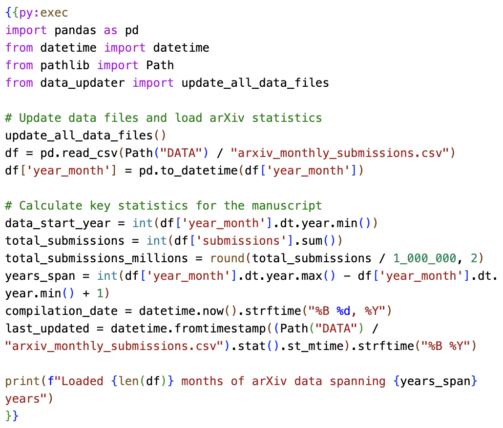

# Rxiv-Maker: an automated template engine for streamlined scientific publications
<!-- note that this title is not rendered in the PDF, instead the one in the YAML metadata is used -->

## Abstract
The rapid growth of preprint servers has accelerated scientific dissemination but has also shifted the technical burden of manuscript preparation to authors. This challenge is particularly acute in computational research, where manuscripts must remain synchronised with evolving data and code. We present Rxiv-Maker, a framework that resolves this by converting simple Markdown files into professionally typeset, publication-ready PDFs. Its core feature is the ability to execute embedded code, creating a self-updating manuscript where figures and statistical values are generated directly from source data during compilation. This ensures that the final document is always current and fully reproducible. By integrating with standard tools like Git and Visual Studio (VS) Code, Rxiv-Maker provides an efficient, transparent, and collaborative authoring experience, applying principles of software engineering to academic writing to foster open and verifiable science.

## Introduction
The landscape of scientific publishing has been profoundly reshaped by the rise of preprint servers, which facilitate rapid dissemination of research findings across numerous platforms [@beck2020; @levchenk2024; @Fraser2020_preprint_growth] (@sfig:arxiv_growth, @sfig:preprint_trends). This acceleration, however, has transferred the complex task of typesetting from publishers to researchers [@Vale2015_preprints; @Tenant2016_academic_publishing; @lin2020]. For those of us in computational fields, this is compounded by a more pressing challenge: ensuring the manuscript remains perfectly synchronised with our data and analysis code. We have all faced the tedious and error-prone task of manually updating a p-value or a sample size in the text after re-running an analysis [@perkel2022]. This disconnect between the research and the report is a critical issue, particularly in disciplines like bioimage analysis, where our findings are built upon complex computational pipelines [@biaflows2024; @dl4miceverywhere2024].

{#fig:system_diagram tex_position="t"} **System Architecture.** Rxiv-Maker integrates Markdown content, YAML metadata, executable scripts, and bibliographies through a processing engine that combines local execution with LaTeX compilation to produce publication-ready PDFs.

{#fig:workflow width="\textwidth" tex_position="t" caption_width="\textwidth"} **Processing Pipeline.** User-provided content (left) undergoes automated processing (right), including parsing, script execution, LaTeX conversion, and PDF compilation.

To address these pain points, we developed Rxiv-Maker, a framework designed to streamline the creation of scientific manuscripts. It automates the production of publication-ready PDFs from simple Markdown, harnessing the typesetting power of LaTeX without requiring the author to write LaTeX code. Rxiv-Maker transforms the document into a self-updating manuscript by executing embedded Python or R scripts during compilation. This approach forges a direct, traceable link between the data and the final publication, eliminating manual transcription errors and ensuring the document is always synchronised with the latest results. The framework is designed as a local-first system, providing a rapid and responsive authoring experience that integrates seamlessly with version control systems like Git, thereby enhancing transparency and collaboration [@Ram2013_git_science; @Perez-Riverol2016_github_bioinformatics]. The overall architecture and processing pipeline are illustrated in @fig:system_diagram and @fig:workflow, respectively. A tutorial is provided to guide new users through their first manuscript (@snote:getting_started).

## Results

### From Static Text to Self-Updating Manuscripts
A central achievement of Rxiv-Maker is its ability to create dynamic, self-updating documents. By embedding executable code snippets directly within the Markdown source, the manuscript transitions from a static report to a living document. This functionality enables the direct execution of analysis scripts during compilation, with the results (whether statistical values, tables, or figures) directly injected into the text. This process eliminates the possibility of transcription errors when, for example, copying a value from a terminal or another program into the manuscript.
We demonstrate this with a practical example from this very paper. The Python code shown in @fig:python_snippet is embedded in the source of our manuscript. At build time, it retrieves the latest public data on arXiv submissions, calculates key statistics, and inserts them into the text. This ensures that our discussion of preprint growth is always based on the most current evidence available. The analysis reveals that, since {{py:get data_start_year}}, a total of {{py:get total_submissions_millions}} million submissions have been made over {{py:get years_span}} years (@sfig:arxiv_growth). These are not static numbers; they were computed when this document was compiled on {{py:get compilation_date}}, using data updated in {{py:get last_updated}}. This capability extends to all forms of programmatic figure generation, as detailed in @snote:programmatic_figures, ensuring that every visual and numerical claim is reproducibly generated.

<!-- The code snippet below is executed at build time to inject dynamic values into the text -->
{{py:exec
import pandas as pd
from datetime import datetime
from pathlib import Path
from data_updater import update_all_data_files

# Update data files and load arXiv statistics
update_all_data_files()
df = pd.read_csv(Path("DATA") / "arxiv_monthly_submissions.csv")
df['year_month'] = pd.to_datetime(df['year_month'])

# Calculate key statistics for the manuscript
data_start_year = int(df['year_month'].dt.year.min())
total_submissions = int(df['submissions'].sum())
total_submissions_millions = round(total_submissions / 1_000_000, 2)
years_span = int(df['year_month'].dt.year.max() - df['year_month'].dt.year.min() + 1)
compilation_date = datetime.now().strftime("%B %d, %Y")
last_updated = datetime.fromtimestamp((Path("DATA") / "arxiv_monthly_submissions.csv").stat().st_mtime).strftime("%B %Y")

print(f"Loaded {len(df)} months of arXiv data spanning {years_span} years")
}}

{#fig:python_snippet tex_position="b"} **Embedded Python for dynamic content.** This figure shows a Python script embedded in the manuscript's source code. The script is executed at build time to compute data attributes (e.g., total submissions and span of years) and inject the resulting values directly into the text. This process, rendered here with syntax highlighting from the Rxiv-Maker VS Code extension, eliminates manual transcription errors and ensures the text remains synchronised with the source data.

### Automated Professional Typesetting from Simple Text
Rxiv-Maker allows researchers to achieve the typographic quality of LaTeX while writing in simple, intuitive Markdown. This is accomplished through a sophisticated, multi-pass translator that converts Markdown to LaTeX in a guarded manner. We recognised that a naive, single-pass conversion would be too fragile for academic documents, where complex syntax for mathematics, citations, and cross-references must be preserved.
Our translator first identifies and protects delicate elements: mathematical expressions (@snote:mathematical_formulas), code blocks, and citation keys. Subsequent passes then normalise document structure and intelligently convert Rxiv-Maker's extended Markdown syntax into the corresponding LaTeX commands, supporting comprehensive text formatting including **bold**, *italic*, __underlined__, and other typographic elements. The system handles complex nested formatting combinations such as __**bold within underline**__ and **__underlined within bold__** seamlessly. For instance, it transforms image syntax into floating figure environments, automatically handling captions, labels, and layout parameters. This process enables authors to specify figure widths or positions using simple options in Markdown, without needing to modify LaTeX code. The system supports a wide array of figure generation methods, from static images to script-based visualisations (@stable:figure_formats), ensuring all visual elements are correctly and professionally typeset. For more advanced formatting needs, including complex tables, users can directly inject LaTeX code using `{{tex:...}}` blocks. A complete syntax reference and example are detailed in @snote:markdown-syntax.

### An Integrated and Rapid Authoring Experience
We designed Rxiv-Maker to provide a seamless and efficient writing experience. The framework operates as a local-first command-line tool, which means that compilation is fast and authors receive immediate feedback on their changes. This rapid iteration is enhanced by an intelligent caching system that remembers which figures and results are already built. It computes a unique signature: a checksum from a figure's source code and data dependencies. A script is only re-executed if this signature has changed, saving valuable time during compilation without compromising reproducibility, as further explained in @snote:caching_validation.
To lower the barrier to entry, we developed a companion extension for Visual Studio Code (@sfig:vscode_extension). This extension acts as a helpful assistant, providing syntax highlighting for our extended Markdown, autocompletion for citation keys and cross-references, and real-time validation of the manuscript's configuration. This integration of authoring and validation into a single, familiar environment streamlines the writing process, allowing researchers to focus on their content rather than on the technical details of typesetting.

### Designed for Transparent and Collaborative Science
Reproducibility and collaboration are at the heart of Rxiv-Maker. By design, the entire manuscript is structured to be managed with Git, the version control system that is standard in software development. This includes the text, code, data, and configuration. This treats the manuscript as a complete, self-contained project where every change is tracked, attributed, and auditable. This aligns perfectly with the principles of open science, creating a transparent history of the research from its inception to the final publication.
The framework's command-line interface includes a powerful `rxiv validate` command that serves as a quality control gatekeeper. It performs a series of checks, such as verifying that all figures are present, all cross-references are valid, and all bibliographic entries are correctly formatted. This validation can be integrated into automated workflows, for instance, as a pre-commit hook to prevent broken versions from entering the project history, or as a check in a continuous integration (CI) pipeline to ensure that a manuscript is always ready for dissemination. This brings the rigour of professional software engineering to the academic writing process.

## Discussion
Rxiv-Maker finds its place in a growing ecosystem of tools designed to enhance scientific publishing. Our approach is distinct from collaborative web-based editors like Overleaf [@Overleaf2024], which, while excellent for team-based LaTeX writing, do not address the fundamental challenge of keeping a manuscript synchronised with external data and analysis code [@HenriquesLab2015_template]. Our philosophy is more closely aligned with that of platforms like Manubot [@himmelstein2019], Jupyter Book [@JupyterBook2020], and Quarto [@Quarto2024], which also integrate code and narrative, often building on notebook-based formats [@Jupyter2016_notebook]. However, Rxiv-Maker is specifically optimised for the production of high-quality, submission-ready manuscripts from a local-first, developer-centric workflow. Beyond preprint distribution, rxiv-maker excels at generating professional manuscripts suitable for first submission to peer-reviewed journals, providing publication-quality PDFs and clean LaTeX source code that many journals readily accept prior to their final journal-specific formatting requirements. This positions rxiv-maker as a comprehensive solution spanning the entire academic publishing pipeline—from initial draft through preprint distribution to journal submission. As shown in our comparison with other tools (@stable:tool-comparison), its unique strengths lie in its self-updating capabilities, its intelligent caching for rapid rebuilds, and its deep integration with the Git-based workflows that are common in computational research. We also note other modern typesetting systems like Typst [@Typst2024] and frameworks like Bookdown [@Xie2016_bookdown], which offer alternative paradigms for scientific document creation.
While powerful, Rxiv-Maker has limitations. Its primary output is currently PDF, which is ideal for preprints but less suited for the web. To address this, we plan to integrate Pandoc [@pandoc2020] into our pipeline, which will enable multi-format outputs, such as HTML and EPUB, while preserving our commitment to typographic quality. We also intend to enhance the framework's integration with computational environment managers to further improve the portability and reproducibility of our executable manuscripts across different systems and institutions [@biaflows2024; @dl4miceverywhere2024], for which containerisation technologies are also a valid alternative [@Boettiger2015_docker_reproducibility; @gomes2018].
By applying the principles of literate programming [@Knuth1984_literate_programming] to the creation of academic papers, Rxiv-Maker helps bridge the gap between computational research and traditional scientific publishing. It fosters a workflow where the manuscript is not merely a report of the research, but a reproducible and verifiable embodiment of it. In an era where the responsibility for typesetting and validation increasingly falls to authors, tools that automate quality control and promote rigour are essential. Rxiv-Maker is our contribution to this movement, offering a framework that empowers researchers to produce transparent, reproducible, and professionally polished manuscripts with confidence and efficiency.

## Methods
The Rxiv-Maker framework is implemented as a modular, Python-based engine designed to ensure computational reproducibility at every stage of manuscript preparation. The processing pipeline begins by establishing an isolated and consistent computational environment, where all dependencies for Python, R, and LaTeX are managed. This ensures that a manuscript can be reliably recompiled on different machines and in the future. The framework's overall architecture is detailed in @sfig:architecture.
The core of our approach is transforming the manuscript into an executable document. The engine identifies and runs embedded Python or R scripts to generate figures and statistical values directly from source data, as described in @snote:programmatic_figures. To ensure a rapid and interactive authoring experience, this process is optimised with an intelligent caching system. It computes content-based checksums of the source scripts and their data dependencies, so that code is only re-executed when a genuine change has been made (@snote:caching_validation). This saves significant time during iterative writing without compromising the integrity of the results.
To convert the author's simple Markdown into a professional LaTeX document, we developed a robust, multi-pass translator. This translator employs a content-protection strategy, first identifying and isolating delicate syntactic structures, including mathematical equations (@snote:mathematical_formulas), citation keys, and code blocks. Subsequent passes then normalise the document structure and map Rxiv-Maker's extended syntax for figures and cross-references to the appropriate LaTeX commands. This guarded approach enables authors to leverage the simplicity of Markdown without compromising the complex syntax necessary for academic publishing.
A multi-level validation system provides continuous quality control. Before compilation, it checks for common errors, such as missing files or broken references. During compilation, it parses LaTeX and BibTeX logs to provide clear, actionable error messages. This automated quality control is essential for maintaining the integrity of the document throughout the authoring process.
Finally, to ensure maximum reproducibility, the framework supports multiple deployment strategies. The primary recommended approach is a local installation, which requires Python and a LaTeX distribution. This method offers an excellent combination of high usability and reproducibility, with collaboration managed through Git. For absolute environmental consistency, which is particularly valuable for large collaborations or long-term archival, a fully containerised version is also available. This requires Docker but encapsulates the entire build environment, guaranteeing that the manuscript can be recompiled with bit-for-bit identical results on any system.

## Data availability
The arXiv monthly submission data used in this article is available at [https://arxiv.org/stats/monthly_submissions](https://arxiv.org/stats/monthly_submissions). Preprint submissions data across different hosting platforms is available at [https://github.com/esperr/pubmed-by-year](https://github.com/esperr/pubmed-by-year). The source code and data for the figures in this article are available at [https://github.com/HenriquesLab/rxiv-maker](https://github.com/HenriquesLab/rxiv-maker).

## Code availability
The Rxiv-Maker computational framework is available at [https://github.com/HenriquesLab/rxiv-maker](https://github.com/HenriquesLab/rxiv-maker). The companion Visual Studio Code extension is at [https://github.com/HenriquesLab/vscode-rxiv-maker](https://github.com/HenriquesLab/vscode-rxiv-maker). For users requiring containerised execution, the docker-rxiv-maker repository provides Docker-based deployment at [https://github.com/HenriquesLab/docker-rxiv-maker](https://github.com/HenriquesLab/docker-rxiv-maker). All repositories are released under an MIT License.

## Author contributions
Bruno M. Saraiva, Guillaume Jacquemet, and Ricardo Henriques conceived the project and designed the framework. António D. Brito beta-tested features and troubleshooted user experience. All authors contributed to writing and reviewing the manuscript.

## Acknowledgements
The authors thank Jeffrey Perkel for feedback that helped improve the manuscript. B.S. and R.H. acknowledge support from the European Research Council (ERC) under the European Union's Horizon 2020 research and innovation programme (grant agreement No. 101001332) (to R.H.) and funding from the European Union through the Horizon Europe program (AI4LIFE project with grant agreement 101057970-AI4LIFE and RT-SuperES project with grant agreement 101099654-RTSuperES to R.H.). Funded by the European Union. However, the views and opinions expressed are those of the authors only and do not necessarily reflect those of the European Union. Neither the European Union nor the granting authority can be held responsible for them. This work was also supported by a European Molecular Biology Organization (EMBO) installation grant (EMBO-2020-IG-4734 to R.H.), a Chan Zuckerberg Initiative Visual Proteomics Grant (vpi-0000000044 with https://doi.org/10.37921/743590vtudfp to R.H.), and a Chan Zuckerberg Initiative Essential Open Source Software for Science (EOSS6-0000000260). This study was supported by the Academy of Finland (no. 338537 to G.J.), the Sigrid Juselius Foundation (to G.J.), the Cancer Society of Finland (Syöpäjärjestöt, to G.J.), and the Solutions for Health strategic funding to Åbo Akademi University (to G.J.). This research was supported by the InFLAMES Flagship Program of the Academy of Finland (decision no. 337531).