# Rxiv-Maker: an automated template engine for streamlined scientific publications
<!-- note that this title is not rendered in the PDF, instead the one in the YAML metadata is used -->

## Abstract
Preprint servers accelerate research dissemination, but authors still face complex manuscript preparation without professional typesetting support. Rxiv-Maker enables researchers to create documents using a framework that converts Markdown into publication-standard PDFs. It automatically translates the markdown text into LaTeX, so researchers don't have to write any LaTeX code themselves. This tool transforms simple documents into dynamic, version-controlled files that work well with modern team collaboration and ongoing updates. Rxiv-Maker executes Python and R scripts for on-the-fly figure generation, ensuring visualisations stay current with data and analyses. Automated build environments, Docker support, and built-in citation and cross-reference management ensure reliable, reproducible builds across systems, while the conversion process handles mathematical equations and formatting. Rxiv-Maker simplifies professional typesetting, promoting clear and open scientific publishing. This manuscript showcases Rxiv-Maker's capabilities, serving as a testament to its elegance in action.

## Main

<!-- Introduction -->

Preprint servers like arXiv, bioRxiv, and medRxiv have become central to research communication [@beck2020;@levchenk2024;@Fraser2020_preprint_growth]. As submission rates climb (@sfig:arxiv_growth, @sfig:preprint_trends), researchers now handle tasks once managed by journal production teams [@Vale2015_preprints;@Tenant2016_academic_publishing]. Most manuscript preparation workflows use proprietary formats that work poorly with version control systems, making collaborative research more difficult [@lin2020].

Computational research faces particular challenges because algorithms, analysis methods, and processing pipelines change frequently. In computational biology, researchers struggle to keep manuscripts synchronised with evolving analysis code, leading to publications that don't accurately describe the methods used. 

Bioimage analysis shows these problems clearly: collaborative frameworks [@biaflows2024] and containerised analysis environments [@dl4miceverywhere2024] highlight how important reproducible computational workflows are for scientific publishing.

Rxiv-Maker helps address these challenges by providing a developer-centric framework for reproducible preprint preparation. It generates publication-standard PDFs through automated LaTeX processing and works directly with Git workflows and continuous integration practices. Built-in reproducibility features ensure manuscripts build consistently across different systems and over time.

Manuscript preparation becomes a transparent process that gives researchers access to professional typesetting tools. A Visual Studio Code extension provides syntax highlighting and automated citation management. Researchers can leverage familiar development environments while maintaining rigorous version control and reproducibility guarantees. This bridges traditional authoring workflows with contemporary best practices in computational research.

<!-- Example 1: Standard single-column figure positioning -->
<!-- tex_position="t" places the figure at the top of the page (recommended default) -->
<!-- width not specified defaults to \linewidth (full column width) -->

{#fig:system_diagram tex_position="t"} **The Rxiv-Maker System Diagram.** The system integrates Markdown content, YAML metadata, Python and R scripts, and bibliography files through a processing engine. This engine leverages GitHub Actions, virtual environments, and LaTeX to produce a publication-ready scientific article, demonstrating a fully automated and reproducible pipeline.

<!-- Example 2: Full-width two-column spanning figure -->
<!-- width="\textwidth" makes the figure span both columns (use figure* environment) -->
<!-- tex_position="t" maintains top placement preference -->  
<!-- This combination is perfect for detailed workflow diagrams that need maximum width -->

{#fig:workflow width="\textwidth" tex_position="t"} **Rxiv-Maker Workflow: User Input vs. Automated Processing.** The framework clearly separates user responsibilities (content creation and configuration) from automated processes (parsing, conversion, compilation, and output generation). Users only need to write content and set preferences. At the same time, the system handles all technical aspects of manuscript preparation automatically, ensuring a streamlined workflow from markdown input to publication-ready PDF output.

<!-- For comprehensive figure positioning guidance, see docs/tutorials/figure-positioning.md -->
<!-- This covers positioning attributes, width control, panel references, and troubleshooting -->

The framework enables programmatic generation of figures and tables using Python and R scripting with visualisation libraries including Matplotlib [@Hunter2007_matplotlib] and Seaborn [@Waskom2021_seaborn]. 

Figures can be generated directly from source datasets during compilation, establishing transparent connections between raw data, processing pipelines, and final visualisations. This executable manuscript approach eliminates the manual copy-and-paste workflow that traditionally introduces errors when transferring results between analysis and documentation [@perkel2022]. When datasets are updated or algorithms refined, affected figures are automatically regenerated, ensuring consistency and eliminating outdated visualisations. The system integrates Mermaid.js [@Mermaid2023_documentation] for generating technical diagrams from text-based syntax, with the complete range of supported methods detailed in @stable:figure-formats.

This approach reframes manuscripts as executable outputs of the research process rather than static documentation. Built upon the HenriquesLab bioRxiv template [@HenriquesLab2015_template], Rxiv-Maker extends capabilities through automated processing pipelines. The architecture, detailed in @fig:system_diagram and @fig:workflow, provides automated build processes through GitHub Actions and virtual environments (technical details described in @snote:figure-generation).

Academic authors use various tools depending on their research needs and technical requirements. Traditional LaTeX environments like Overleaf democratise professional typesetting through accessible web interfaces, but struggle with version control and computational content integration. 

Multi-format publishing platforms including Quarto, R Markdown, and Bookdown excel at producing multiple output formats with statistical integration, though they introduce complexity for simple documents and variable LaTeX typesetting quality. Collaborative writing frameworks such as Manubot enable transparent, version-controlled scholarly communication with automated citation management [@himmelstein2019], yet offer limited computational reproducibility features. 

Web-first computational systems like MyST and Jupyter Book prioritise interactive content and browser-native experiences, but compromise PDF output quality and offline accessibility. Modern typesetting engines like Typst provide cleaner syntax and faster compilation, though ecosystem maturity and adoption remain barriers.

Rxiv-Maker occupies a specialised niche at the intersection of developer workflows, academic publishing, and computational reproducibility. This developer-centric approach requires technical setup but delivers automated, reproducible PDF preprint generation particularly suited to computational research where datasets evolve and algorithmic documentation is essential. The framework trades initial complexity for long-term automation benefits, enabling deeper specialisation for manuscripts involving dynamic content and processing pipelines. A comprehensive comparison is provided in @stable:tool-comparison.

<!-- Results -->

Rxiv-Maker simplifies manuscript creation by building reproducibility directly into the writing process. Writers work in familiar Markdown, which the system converts to LaTeX and compiles into publication-ready PDFs with proper formatting, pagination, and high-quality figures.

Docker containerisation addresses computational reproducibility by encapsulating the complete environment (LaTeX distributions, Python libraries, R packages, and system dependencies) within immutable container images. GitHub Actions workflows leverage pre-compiled Docker images for standardised compilation processes, reducing build times from 8-10 minutes to approximately 2 minutes. 

The Docker engine mode enables researchers to generate PDFs with only Docker and python as prerequisites. This is valuable for collaborative research across platforms or institutional settings with software restrictions [@Boettiger2015_docker_reproducibility].

The system automatically saves all generated files, creating a complete record from source materials to the finished document. For users who want immediate feedback, we provide Google Colab notebook deployment that compiles documents in real-time while preserving reproducibility.

For Google Colab environments that restrict privileged container execution, we provide a specialized implementation using udocker [@gomes2018] for unprivileged container deployment. This approach cuts setup time dramatically (from about 20 minutes down to 4 minutes) by running pre-configured containers with all dependencies already installed, eliminating manual setup and ensuring consistency between Colab sessions. For standard development environments, Docker and Podman provide native containerization. Available deployment strategies are compared in @stable:deployment-options.

When working with figures, the system handles both static images and dynamic content. Drop Python or R scripts into designated folders, and Rxiv-Maker will execute them during compilation, pulling in data, running analyses, and generating visualisations that appear in the final PDF [@Jupyter2016_notebook]. It even renders Mermaid.js diagrams from markdown into crisp SVG images. This approach makes manuscripts complete, verifiable records of research where readers can trace every figure and result back to its source code and data.

The Visual Studio Code extension provides editing features including real-time syntax highlighting, autocompletion for bibliographic citations from BibTeX files, and cross-reference management. The extension reduces cognitive load and minimises syntax errors while maintaining consistent formatting.

<!-- Discussion and conclusions section -->

Rxiv-Maker combines plain-text authoring with automated build environments to address consistency and reproducibility challenges in scientific publishing. Following literate programming principles [@Knuth1984_literate_programming], it creates documents that blend narrative text with executable code while hiding typesetting complexity. Git integration provides transparent attribution, conflict-free merging, and complete revision histories [@Ram2013_git_science;@Perez-Riverol2016_github_bioinformatics], supporting collaborative practices needed for open science.

Preprint servers have transferred quality control and typesetting responsibilities from journals to individual authors, creating both opportunities and challenges for scientific communication. Rxiv-Maker provides automated safeguards that help researchers produce publication-quality work without extensive typesetting knowledge, making professional publishing tools available through GitHub-based infrastructure.

The focus on PDF output via LaTeX optimises preprint workflows for scientific publishing requirements. We plan to extend format support by integrating universal converters such as Pandoc [@pandoc2020], while preserving typographic control and reproducibility standards. 

The Visual Studio Code extension addresses adoption barriers by providing familiar development environments that bridge text editing with version control workflows. Future development will prioritise deeper integration with computational environments and quality assessment tools, building upon established collaborative frameworks [@biaflows2024] and containerised approaches that enhance reproducibility [@dl4miceverywhere2024]. 

The system supports scientific publishing through organised project structure separating content, configuration, and computational elements. All manuscript content, metadata, and bibliographic references are version-controlled, ensuring transparency.

The markdown-to-LaTeX conversion pipeline handles complex academic syntax including figures, tables, citations, and mathematical expressions while preserving semantic meaning and typographical quality. The system uses a multi-pass approach that protects literal content during transformation, ensuring intricate scientific expressions render accurately. 

The framework supports subscript and superscript notation essential for chemical formulas, allowing expressions such as $\text{H}_2\text{O}$, $\text{CO}_2$, $\text{Ca}^{2+}$, $\text{SO}_4^{2-}$, and $E=mc^2$, as well as temperature notation like 25°C.

The system's mathematical typesetting capabilities extend to numbered equations, which are essential for scientific manuscripts. For instance, the fundamental equation relating mass and energy can be expressed as:

$$E = mc^2$${#eq:einstein}

The framework also supports more complex mathematical formulations, such as the standard deviation calculation commonly used in data analysis:

$$\sigma = \sqrt{\frac{1}{N-1} \sum_{i=1}^{N} (x_i - \bar{x})^2}$${#eq:std_dev}

Additionally, the system handles chemical equilibrium expressions, which are crucial in biochemical and chemical research:

$$K_{eq} = \frac{[\text{Products}]}{[\text{Reactants}]} = \frac{[\text{Ca}^{\text{2+}}][\text{SO}_4^{\text{2-}}]}{[\text{CaSO}_4]}$${#eq:equilibrium}

These numbered equations (@eq:einstein, @eq:std_dev, and @eq:equilibrium) demonstrate the framework's capability to handle diverse mathematical notation while maintaining proper cross-referencing throughout the manuscript. This functionality ensures that complex scientific concepts can be presented with the precision and clarity required for academic publication.

Rxiv-Maker is optimised for reproducible PDF preprint generation within the scientific authoring ecosystem. While platforms such as Overleaf and Quarto offer multi-format capabilities, Rxiv-Maker provides focused, developer-centric workflows that integrate with version control and automated build environments.

The framework provides practical training in version control, automated workflows, and computational reproducibility, which are skills fundamental to modern scientific practice. Researchers learn technical skills including Git proficiency, markdown authoring, continuous integration, and containerised environments. The system is designed to be accessible without extensive programming backgrounds, featuring comprehensive documentation and intuitive workflows that reduce barriers and foster skill development.

The technical architecture addresses computational constraints of cloud-based build systems through intelligent caching and selective content regeneration. The framework supports high-resolution graphics and advanced figure layouts while maintaining optimal document organisation and cross-referencing functionality.

Computational research faces a growing disconnect between advanced analytical methods and traditional publishing workflows. Rxiv-Maker addresses this by treating manuscripts as executable code rather than static documents, bringing collaborative development practices from software engineering to scientific communication. This enables transparent, verifiable publications suitable for both immediate sharing and long-term preservation.

The framework's impact extends beyond technical capabilities to foster a culture of computational literacy and transparent science. As preprint servers continue to reshape academic publishing, tools like Rxiv-Maker become essential infrastructure for maintaining quality and reproducibility in researcher-led publication processes. The framework serves as both a practical solution for immediate publishing needs and a foundation for advancing open science principles across diverse research domains.

## Methods

This section describes the Rxiv-Maker framework technically, showing how the system generates structured documentation from source code and plain text. System architecture is detailed in @sfig:architecture.

### Processing Pipeline
Rxiv-Maker processes manuscripts through a five-stage pipeline controlled by a central `Makefile` that converts source files into publication-ready PDFs. The pipeline ensures computational reproducibility through these stages:

1. **Environment Setup**: Automated dependency resolution with containerised environments using Docker or local virtual environments with pinned package versions
2. **Content Generation**: Conditional execution of Python/R scripts and Mermaid diagram compilation based on modification timestamps
3. **Markdown Processing**: Multi-pass conversion with intelligent content protection preserving mathematical expressions, code blocks, and LaTeX commands
4. **Asset Aggregation**: Systematic collection and validation of figures, tables, and bibliographic references with integrity checking
5. **LaTeX Compilation**: Optimised `pdflatex` sequences with automatic cross-reference and citation resolution

For users without local LaTeX installations, the framework provides identical build capabilities through cloud-based GitHub Actions, making professional publishing workflows accessible while maintaining reproducibility guarantees.

### Markdown-to-LaTeX Conversion
Manuscript conversion is handled by a Python processing engine that manages complex academic syntax requirements through "rxiv-markdown". This multi-pass conversion system uses content protection strategies to preserve computational elements such as code blocks and mathematical notation. It converts specialised academic elements including dynamic citations (`@smith2023`), programmatic figures, statistical tables, and supplementary notes before applying standard markdown formatting. 

The system supports notation essential for scientific disciplines: subscript and superscript syntax for chemical formulas such as $\text{H}_2\text{O}$ and $\text{CO}_2$, mathematical expressions including Einstein's mass-energy equivalence (@eq:einstein), chemical notation such as $\text{Ca}^{2+}$ and $\text{SO}_4^{2-}$ (@eq:equilibrium), temperature specifications like 25°C, and statistical calculations including standard deviation (@eq:std_dev). Supported syntax is detailed in @stable:markdown-syntax. The framework supports complex mathematical expressions typical of computational workflows:

$$\frac{\partial}{\partial t} \mathbf{u} + (\mathbf{u} \cdot \nabla) \mathbf{u} = -\frac{1}{\rho} \nabla p + \nu \nabla^2 \mathbf{u}$${#eq:navier_stokes}

This approach provides accessible alternatives for common formulas while ensuring complex equations like the Navier-Stokes equation (@eq:navier_stokes) are rendered with professional quality. Mathematical formula support is detailed in @snote:mathematical-formulas. 

### Programmatic Content and Environments
The framework generates figures, statistical analyses, and algorithmic diagrams as reproducible outputs linked to source data and processing pipelines. The build pipeline executes Python, R, and Mermaid scripts with caching to avoid redundant computation while maintaining traceability between datasets, algorithms, and visualisations (@snote:figure-generation). 

Rxiv-Maker implements multi-layered environment management to address complex dependency requirements. Dependencies are rigorously pinned, isolated virtual environments support development workflows, and containerised environments ensure consistent execution across computing platforms. Cloud-based GitHub Actions provide controlled, auditable build environments that guarantee identical computational outcomes across systems.

### Deployment Architecture and Platform Considerations
The framework provides flexible deployment strategies for diverse research environments. Local installation offers optimal performance and universal architecture compatibility, supporting AMD64 and ARM64 systems with direct access to native resources required for diagram generation. This approach enables faster iteration cycles and comprehensive debugging capabilities.

Containerised execution through Docker Engine Mode eliminates local dependency management by providing pre-configured environments containing LaTeX distributions, Python libraries, R packages, and Node.js tooling. Docker deployment uses AMD64 base images because Google Chrome has limitations on ARM64 Linux. These run via Rosetta emulation on Apple Silicon systems. For optimal performance on ARM64 systems, local installation provides full capabilities without emulation overhead.

Cloud-based deployment through GitHub Actions provides architecture-agnostic automated builds for continuous integration workflows. The modular architecture enables researchers to select deployment strategies appropriate to technical constraints while maintaining reproducibility guarantees.

### Visual Studio Code Extension
Rxiv-Maker includes a Visual Studio Code extension providing an integrated development environment for collaborative manuscript preparation. The extension leverages the Language Server Protocol delivering real-time syntax highlighting for academic markdown syntax, intelligent autocompletion for bibliographic citations from BibTeX files, and context-aware suggestions for cross-references to figures, tables, equations, and supplementary materials. The extension integrates with the main framework through file system monitoring and automated workspace detection, recognising rxiv-maker project structures and providing appropriate editing features. Schema validation for YAML configuration files ensures project metadata adheres to reproducibility specifications, while integrated terminal access enables direct execution of framework commands. This provides researchers with accessible, feature-rich editing experience maintaining reproducibility guarantees while reducing technical barriers.

### Quality Assurance
Framework reliability is ensured through multi-level validation protocols. Unit tests validate individual components, integration tests verify end-to-end pipelines, and platform tests validate deployment environment behaviour. Pre-commit pipelines enforce code formatting, linting, and type checking, ensuring code quality.

## Data availability
arXiv monthly submission data used in this article is available at [https://arxiv.org/stats/monthly_submissions](https://arxiv.org/stats/monthly_submissions). Preprint submissions data across different hosting platforms is available at [https://github.com/esperr/pubmed-by-year](https://github.com/esperr/pubmed-by-year). The source code and data for the figures in this article are available at [https://github.com/HenriquesLab/rxiv-maker](https://github.com/HenriquesLab/rxiv-maker).

## Code availability
The Rxiv-Maker computational framework is available at [https://github.com/HenriquesLab/rxiv-maker](https://github.com/HenriquesLab/rxiv-maker). The framework includes comprehensive documentation, example manuscripts, and automated testing suites to ensure reliability across different deployment environments. Additionally, the Visual Studio Code extension for Rxiv-Maker is available at [https://github.com/HenriquesLab/vscode-rxiv-maker](https://github.com/HenriquesLab/vscode-rxiv-maker), providing researchers with an integrated development environment that includes syntax highlighting, intelligent autocompletion for citations and cross-references, schema validation for configuration files, and seamless integration with the main framework's build processes. All source code is under an MIT License, enabling free use, modification, and distribution for both academic and commercial applications.

## Author contributions
Both Bruno M. Saraiva, Guillaume Jacquemet, and Ricardo Henriques conceived the project and designed the framework. All authors contributed to writing and reviewing the manuscript.

## Acknowledgements
The authors thank Jeffrey Perkel for feedback that helped improve the manuscript. B.S. and R.H. acknowledge support from the European Research Council (ERC) under the European Union's Horizon 2020 research and innovation programme (grant agreement No. 101001332) (to R.H.) and funding from the European Union through the Horizon Europe program (AI4LIFE project with grant agreement 101057970-AI4LIFE and RT-SuperES project with grant agreement 101099654-RTSuperES to R.H.). Funded by the European Union. However, the views and opinions expressed are those of the authors only and do not necessarily reflect those of the European Union. Neither the European Union nor the granting authority can be held responsible for them. This work was also supported by a European Molecular Biology Organization (EMBO) installation grant (EMBO-2020-IG-4734 to R.H.), a Chan Zuckerberg Initiative Visual Proteomics Grant (vpi-0000000044 with https://doi.org/10.37921/743590vtudfp to R.H.), and a Chan Zuckerberg Initiative Essential Open Source Software for Science (EOSS6-0000000260). This study was supported by the Academy of Finland (no. 338537 to G.J.), the Sigrid Juselius Foundation (to G.J.), the Cancer Society of Finland (Syöpäjärjestöt, to G.J.), and the Solutions for Health strategic funding to Åbo Akademi University (to G.J.). This research was supported by the InFLAMES Flagship Program of the Academy of Finland (decision no. 337531).
