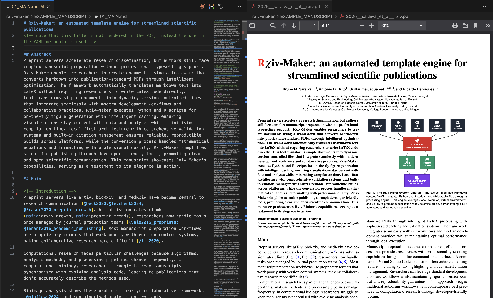

## Supplementary Tables

| **Format** | **Input Extension** | **Processing Method** | **Output Formats** | **Quality** | **Use Case** |
|---------|-----------------|------------------|----------------|---------|----------|
| **Mermaid Diagrams** | `.mmd` | Mermaid CLI | SVG, PNG, PDF | Vector/Raster | Flowcharts, architectures |
| **Python and R Figures** | `.py`, `.R` | Script execution | PNG, PDF, SVG | Publication | Data visualisation |
| **Static Images** | `.png`, `.jpg`, `.svg` | Direct inclusion | Same format | Original | Photographs, logos |
| **LaTeX Graphics** | `.tex`, `.tikz` | LaTeX compilation | PDF | Vector | Mathematical diagrams |
| **Data Files** | `.csv`, `.json`, `.xlsx` | Python and R processing | Via scripts | Computed | Raw data integration |

{#stable:figure_formats} **Supported Figure Generation Methods.** Overview of the framework's figure processing capabilities, demonstrating support for both static and dynamic content generation with an emphasis on reproducible computational graphics.

| **Tool** | **Type** | **Markdown** | **Primary Use Case** | **Key Strengths** | **Open Source** |
|----------|----------|--------------|-------------------|-------------------|-----------------|
| **Rxiv-Maker** | Pipeline | Excellent | Reproducible preprints | Local-first execution, automated caching, rich CLI | Yes |
| **Overleaf** [@Overleaf2024] | Web Editor | Limited | Collaborative LaTeX | Real-time collaboration, rich templates, cloud-based | Freemium |
| **Quarto** [@Quarto2024] | Publisher | Native | Multi-format publishing | Polyglot support, multiple outputs, scientific focus | Yes |
| **Manubot** [@himmelstein2019] | Collaborative | Native | Version-controlled writing | Automated citations, transparent collaboration, Git-based | Yes |
| **Pandoc** [@pandoc2020] | Converter | Excellent | Format conversion | Universal format support, extensible filters | Yes |
| **Typst** [@Typst2024] | Typesetter | Good | Modern typesetting | Fast compilation, modern syntax, growing ecosystem | Yes |
| **Bookdown** [@Xie2016_bookdown] | Publisher | R Markdown | Academic books | Cross-references, multiple formats | Yes |
| **Direct LaTeX** | Typesetter | None | Traditional publishing | Full control, established workflows, mature ecosystem | Yes |

{#stable:tool-comparison} **Comparison of Manuscript Preparation Tools.** This comparison positions each tool within the scientific publishing ecosystem. Rxiv-Maker specialises in reproducible preprint workflows with local-first execution and developer-centric features. Other tools address distinct needs, such as real-time collaborative editing (Overleaf), multi-format output (Quarto), or version-controlled writing (Manubot).

<clearpage>

## Supplementary Notes

{#snote:getting_started} **A Getting Started Tutorial**

To help new users begin with Rxiv-Maker, this tutorial provides a simple walkthrough for creating a minimal manuscript. The process starts with initialising a new project, which sets up the necessary directory structure and configuration files.

First, open a terminal and run the command `rxiv init my_new_paper`. This creates a new directory named `my_new_paper` containing the essential files: `00_CONFIG.yml` for manuscript metadata, `01_MAIN.md` for the main text, `02_SUPPLEMENTARY_INFO.md` for supplementary content, and `03_REFERENCES.bib` for the bibliography. The system also creates subdirectories for `FIGURES` and `DATA`.

Next, you can edit the `01_MAIN.md` file to add your text. You can use standard Markdown for formatting, such as `#` for headings and `*` for italics. To add a citation, simply use the `@key` syntax, where `key` corresponds to an entry in your `.bib` file. For example, to cite the original literate programming paper, you would write `[@Knuth1984_literate_programming]`.

To build the PDF, navigate into the project directory (`cd my_new_paper`) and run the command `rxiv pdf`. The framework will process your files, execute any embedded code, and generate a professionally typeset PDF in the `output` directory. If you encounter any issues, running `rxiv validate` provides a detailed check of your manuscript's integrity, flagging common problems like missing figures or broken citations.

This straightforward process allows you to get from a blank slate to a compiled PDF in minutes, providing a solid foundation that you can then build upon with more advanced features like programmatic figures and tables.

{#snote:markdown-syntax} **Rxiv-Maker Markdown Syntax and Advanced LaTeX Integration**

This comprehensive reference demonstrates the automated translation system that enables researchers to write in familiar markdown syntax whilst producing professional LaTeX output. The table below showcases both the standard Markdown-to-LaTeX translations and serves as a perfect example of Rxiv-Maker's `{{tex:...}}` blocks, which allow direct LaTeX injection for advanced formatting needs.

For complex table structures that require precise control over formatting, multi-column headers, or mathematical notation, Rxiv-Maker's `{{tex:...}}` syntax provides full access to LaTeX's typesetting capabilities. This table itself was created using `{{tex:...}}` blocks, demonstrating how raw LaTeX can be seamlessly integrated into Markdown documents while maintaining the tex block protection system that prevents markdown processing of LaTeX-specific syntax.

{{tex:
\small
\begin{longtable}{|p{0.28\textwidth}|p{0.3\textwidth}|p{0.34\textwidth}|}
\hline
\textbf{Markdown Input} & \textbf{LaTeX Output} & \textbf{Description} \\
\hline
\endfirsthead
\hline
\textbf{Markdown Input} & \textbf{LaTeX Output} & \textbf{Description} \\
\hline
\endhead

\multicolumn{3}{|c|}{\textbf{Basic Text Formatting}} \\
\hline
**bold text** & \textbackslash textbf\{bold text\} & Bold formatting \\
*italic text* & \textbackslash textit\{italic text\} & Italic formatting \\
\_\_underlined text\_\_ & \textbackslash underline\{underlined text\} & Underlined formatting for emphasis \\
**\_\_bold and underlined\_\_** & \textbackslash textbf\{\textbackslash underline\{bold and underlined\}\} & Nested formatting: bold containing underline \\
\_\_**underlined and bold**\_\_ & \textbackslash underline\{\textbackslash textbf\{underlined and bold\}\} & Nested formatting: underline containing bold \\
*\_\_italic and underlined\_\_* & \textbackslash textit\{\textbackslash underline\{italic and underlined\}\} & Multiple formatting combinations \\
\textasciitilde subscript\textasciitilde & \textbackslash textsubscript\{subscript\} & Subscript formatting, e.g., H\textsubscript{2}O, CO\textsubscript{2} \\
\textasciicircum superscript\textasciicircum & \textbackslash textsuperscript\{superscript\} & Superscript formatting, e.g., E=mc\textsuperscript{2}, x\textsuperscript{n} \\
\hline

\multicolumn{3}{|c|}{\textbf{Document Structure}} \\
\hline
\# Header 1 & \textbackslash section\{Header 1\} & Top-level section \\
\#\# Header 2 & \textbackslash subsection\{Header 2\} & Second-level section \\
\#\#\# Header 3 & \textbackslash subsubsection\{Header 3\} & Third-level section \\
\hline

\multicolumn{3}{|c|}{\textbf{Lists}} \\
\hline
- list item & \textbackslash begin\{itemize\}\textbackslash item...\textbackslash end\{itemize\} & Unordered list \\
1. list item & \textbackslash begin\{enumerate\}\textbackslash item...\textbackslash end\{enumerate\} & Ordered list \\
\hline

\multicolumn{3}{|c|}{\textbf{Links and URLs}} \\
\hline
{[}link text{]}(url) & \textbackslash href\{url\}\{link text\} & Hyperlink with custom text \\
https://example.com & \textbackslash url\{https://example.com\} & Bare URL \\
\hline

\multicolumn{3}{|c|}{\textbf{Citations}} \\
\hline
\texttt{@}mycitation & \textbackslash cite\{mycitation\} & Single citation \\
{[}@himmelstein2019;@Overleaf2024{]} & \textbackslash cite\{himmelstein2019,Overleaf2024\} & Multiple citations \\
\hline

\multicolumn{3}{|c|}{\textbf{Cross-References}} \\
\hline
figure:label & \textbackslash ref\{fig:label\} & Figure reference \\
suppfig:label & \textbackslash ref\{sfig:label\} & Supplementary figure \\
table:label & \textbackslash ref\{table:label\} & Table reference \\
suptab:label & \textbackslash ref\{stable:label\} & Supplementary table \\
equation:label & \textbackslash eqref\{eq:label\} & Equation reference \\
note:label & \textbackslash sidenote\{label\} & Supplement note reference \\
\hline

\multicolumn{3}{|c|}{\textbf{Tables and Figures}} \\
\hline
Markdown table & \textbackslash begin\{table\}...\textbackslash end\{table\} & Automatic table formatting \\
Image with caption & \textbackslash begin\{figure\}...\textbackslash end\{figure\} & Figure with caption \\
\hline

\multicolumn{3}{|c|}{\textbf{Document Control}} \\
\hline
\textless !-- comment --\textgreater & \% comment & LaTeX comments \\
<newpage> & \textbackslash newpage & Manual page break \\
<clearpage> & \textbackslash clearpage & Page break with float clearing \\
\hline
\caption{\textbf{Rxiv-Maker Markdown to LaTeX Translation Reference.} Comprehensive mapping of Markdown syntax to corresponding LaTeX commands, demonstrating the automated translation system that enables researchers to write in familiar markup while producing professional typesetting.}
\end{longtable}
}}

{#snote:programmatic_figures} **Programmatic Figure Generation**

Rxiv-Maker's figure generation capabilities are designed to ensure a transparent and reproducible connection between your data and your final visualisations. The system supports two main approaches for creating figures programmatically: script-based generation using Python or R, and diagram rendering from text-based descriptions using Mermaid.

For script-based figures, you place your `.py` or `.R` scripts in the `FIGURES` directory. These scripts often leverage powerful plotting libraries such as Matplotlib [@Hunter2007_matplotlib] or Seaborn [@Waskom2021_seaborn]. During compilation, Rxiv-Maker executes these scripts, and any image files they save (e.g., PNG, PDF, SVG) are automatically detected and can be included in your manuscript. This ensures your visualisations are always synchronised with the underlying data and analysis, as a change in one will trigger the regeneration of the other. This is the method used to produce @sfig:arxiv_growth and @sfig:preprint_trends.

For diagrams, such as flowcharts or system architectures, you can use Mermaid [@Mermaid2023_documentation]. You create a `.mmd` file containing a text-based description of your diagram. The framework uses the Mermaid command-line tool to render this description into a vector or raster image. This allows your diagrams to be version-controlled just like code, making them easy to modify and track over time.

{#snote:mathematical_formulas} **Mathematical Formula Support**

Rxiv-Maker seamlessly integrates mathematical notation by translating Markdown-style expressions into high-quality LaTeX mathematics. This allows you to write complex mathematical content using simple, familiar syntax.

For inline mathematics, you can use single dollar sign delimiters (`$...$`), allowing formulas like $E = mc^2$ to be embedded directly within your text. For larger, display-style equations, you can use double dollar signs (`$$...$$`) to centre the expression on its own line. For example:

$$
i\hbar\frac{\partial}{\partial t}\Psi(\mathbf{r},t) = \hat{H}\Psi(\mathbf{r},t)
$$

The framework's multi-pass translator is designed to protect these mathematical expressions, ensuring they are not accidentally altered during the conversion from Markdown to LaTeX. This robust system supports a wide range of mathematical and statistical notation, from simple symbols to complex multi-line equations, ensuring your quantitative work is always presented clearly and professionally.

{#snote:caching_validation} **Intelligent Caching and Validation**

To accelerate compilation, Rxiv-Maker uses an intelligent caching system that avoids redundant work. It operates by generating a checksum—a unique digital signature—for each figure's dependencies, including the source script and any input data files. A figure is only regenerated if this checksum changes, meaning you can recompile your manuscript rapidly during writing, as only the modified components are rebuilt. This saves considerable time without sacrificing the reproducibility of the final document.

Complementing this is a powerful validation framework that acts as a quality-control mechanism. Running `rxiv validate` performs a multi-level check of your manuscript. Before compilation, it looks for missing figure files, broken cross-references, and malformed bibliography entries. During compilation, it parses LaTeX logs to provide clear, understandable error messages. After compilation, it even performs a lightweight scan of the PDF to flag potential rendering issues. This ensures your manuscript is technically sound at every stage.

## Supplementary Figures

{#sfig:arxiv_growth width="70%" tex_position="p"} **The growth of preprint submissions on the arXiv server (1991-2025).** This figure was generated from public arXiv statistics using a Python script executed by the Rxiv-Maker pipeline, demonstrating reproducible, data-driven visualisation.

{#sfig:preprint_trends width="70%" tex_position="p"} **Preprint Submission Trends Across Multiple Servers (2018-2025).** This figure, showing preprints indexed by PubMed from major repositories, was generated from public data [@PubMedByYear2025] using a reproducible R script within the Rxiv-Maker pipeline.

{#sfig:vscode_extension width="100%" tex_position="p"} **The Rxiv-Maker Visual Studio Code Extension.** The extension enhances the authoring experience by providing syntax highlighting for extended Markdown, autocompletion for citation keys (e.g., `@Knuth...`), and real-time validation to catch errors as you type.

{#sfig:architecture width="90%" tex_position="p"} **Detailed System Architecture.** A comprehensive technical diagram of the Rxiv-Maker architecture, illustrating the input layers, the processing engine's components (parsers, converters, generators), the compilation infrastructure, and the final output generation. This figure highlights the modular design that enables robust and reproducible manuscript compilation.
