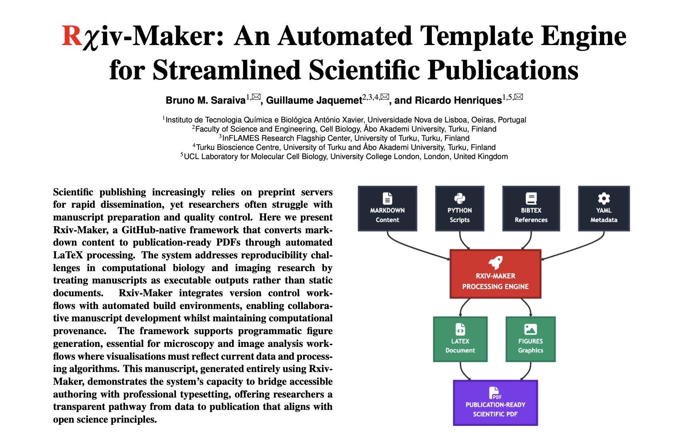

[](https://doi.org/10.48550/arXiv.2508.00836)
[](https://github.com/henriqueslab/rxiv-maker/blob/main/LICENSE)
[](https://github.com/HenriquesLab/rxiv-maker/stargazers)

# Rxiv-Maker


Rxiv-Maker is an automated LaTeX article generation system that transforms scientific writing from chaos to clarity. It converts Markdown manuscripts into publication-ready PDFs with reproducible figures, professional typesetting, and zero LaTeX hassle.

The platform bridges the gap between **easy writing** (Markdown) and **beautiful output** (LaTeX), featuring automated figure generation from Python/R scripts and Mermaid diagrams, seamless citation management, Docker containerization for minimal-dependency execution (only Docker and Make required), and integration with GitHub Actions for accelerated cloud-based PDF generation.

Rxiv-Maker enhances the capabilities of traditional scientific writing by ensuring version control compatibility, facilitating reproducible science workflows, and providing professional formatting that meets publication standards.

## Key Features

- **20+ Enhanced Markdown Features** - Scientific cross-references, citations, subscript/superscript (**rxiv-markdown**)
- **Automated Figure Generation** - Python/R scripts and Mermaid diagrams with smart caching and advanced positioning control
- **Intelligent Validation** - Pre-build error detection with actionable feedback
- **Professional Output** - LaTeX-quality PDFs with various citation styles
- **Multi-Environment** - Local, Docker, Google Colab, and GitHub Actions support
- **Change Tracking** - Visual diff PDFs against git tags
- **VS Code Integration** - Dedicated extension with syntax highlighting
- **Modern CLI** - Beautiful command-line interface with rich output and auto-completion

**Key rxiv-markdown features:** Scientific cross-references (`@fig:label`, `@eq:label`), citations (`@citation`), text formatting (`~subscript~`, `^superscript^`), document control (`<newpage>`), automated figure generation, and precise figure positioning (`tex_position="t"`, `width="\textwidth"`).

## Key Benefits

- **Accessibility** - Write in Markdown without LaTeX expertise
- **Reproducibility** - Automated figures and version control ensure consistent results
- **Flexibility** - Generate PDFs locally, in Docker, or via GitHub Actions
- **Professional Output** - LaTeX-quality formatting with automated bibliography management
- **Collaboration** - Git-based workflows with automated PDF generation

## 🚀 Getting Started

To get started with Rxiv-Maker, we recommend following our comprehensive user guide, which provides detailed instructions for installation, usage, and advanced features.

**➡️ [Read the Full User Guide](docs/getting-started/user_guide.md)**

### Quick Installation
For a quick start, you can install Rxiv-Maker from PyPI:
```bash
pip install rxiv-maker
```
For more detailed installation instructions, including platform-specific guidance and alternative installation methods, please see the **[Installation Guide](docs/getting-started/installation.md)**.

### Basic Usage
Once installed, you can create a new manuscript and generate a PDF with the following commands:
```bash
rxiv init MY_PAPER/
rxiv pdf MY_PAPER/
```
For a complete overview of the available commands and their options, please refer to the **[Command Reference](docs/CLI_REFERENCE.md)**.

## 📚 Documentation

Our documentation provides a comprehensive overview of Rxiv-Maker, from getting started to advanced workflows.

<details>
<summary><strong>📚 Complete Documentation Index</strong></summary>

### Getting Started
- **[Installation Guide](docs/getting-started/installation.md)** - Complete setup for all platforms
- **[User Guide](docs/getting-started/user_guide.md)** - Complete usage instructions

### Platform Guides  
- **[Local Development Setup](docs/platforms/LOCAL_DEVELOPMENT.md)** - Platform-specific installation
- **[Docker Engine Mode](docs/workflows/docker-engine-mode.md)** - Containerized development
- **[Google Colab Tutorial](docs/tutorials/google_colab.md)** - Browser-based PDF generation
- **[GitHub Actions Guide](docs/workflows/github-actions.md)** - Automated cloud builds

### Tutorials
- **[Figure Positioning Guide](docs/tutorials/figure-positioning.md)** - Complete guide to figure placement, sizing, and positioning

### Advanced Features
- **[Change Tracking](docs/workflows/change-tracking.md)** - Version diff PDFs
- **[Troubleshooting](docs/troubleshooting/troubleshooting-missing-figures.md)** - Common issues and fixes
- **[Cache Migration Guide](docs/troubleshooting/cache-migration.md)** - Platform-standard cache directories

### Development
- **[VS Code Extension](https://github.com/HenriquesLab/vscode-rxiv-maker)** - Enhanced editing experience
- **[API Documentation](docs/api/)** - Code reference

### Reference
- **[Rxiv-Markdown Syntax Guide](docs/reference/rxiv-markdown-syntax.md)** - Complete syntax reference for scientific writing
- **[Command Reference](docs/CLI_REFERENCE.md)** - Complete CLI command documentation

</details>

For more details on the project structure, see the **[User Guide](docs/getting-started/user_guide.md)**.

```
rxiv-maker/
├── MANUSCRIPT/              # Your manuscript files
│   ├── 00_CONFIG.yml       # Metadata and configuration
│   ├── 01_MAIN.md          # Main manuscript content
│   ├── 02_SUPPLEMENTARY_INFO.md  # Optional supplementary
│   ├── 03_REFERENCES.bib   # Bibliography
│   └── FIGURES/            # Figure generation scripts
├── output/                 # Generated PDFs and artifacts
├── src/                    # Rxiv-Maker source code
└── docs/                   # Documentation
```

## Docker Strategy

Rxiv-Maker provides robust Docker support through an integrated architecture that ensures consistency across environments while maintaining streamlined development workflows.

### 🏗️ Architecture Overview

**Integrated Design**: Docker infrastructure is maintained in [`src/docker/`](src/docker/) to:
- Enable streamlined development and maintenance workflows
- Provide centralized CI/CD workflows for container builds
- Simplify repository structure and dependency management
- Support rapid iteration and testing of Docker improvements

**Docker Infrastructure**: All Docker build scripts and configuration are consolidated in the [`src/docker/`](src/docker/) directory for simplified management.

### 🐳 Available Images

| Image | Purpose | Use Case |
|-------|---------|----------|
| `henriqueslab/rxiv-maker-base:latest` | Production image | PDF generation with mermaid.ink API |

**Note**: As of v1.8+, we use the mermaid.ink API for diagram generation, eliminating browser dependencies.

### 🚀 Usage Patterns

**Modern CLI**:
```bash
# Use Docker engine for builds
rxiv pdf --engine docker

# Set Docker as default
rxiv config set general.default_engine docker

# Use Docker engine
rxiv pdf --engine docker
```

**Legacy Make Commands**:
```bash
# Standard Docker builds
make pdf RXIV_ENGINE=DOCKER

# Docker builds
make pdf RXIV_ENGINE=DOCKER
```

### ⚙️ Benefits

- **Zero Dependencies**: Only Docker and Make required locally
- **Consistency**: Identical environment across development, CI/CD, and production
- **Performance**: Pre-built images with all dependencies (~5x faster than dependency installation)
- **Isolation**: No conflicts with existing system packages
- **Multi-platform**: AMD64 support with ARM64 compatibility via Rosetta

For detailed Docker documentation, see the [Docker infrastructure directory](src/docker/) and [Docker Engine Mode Guide](docs/workflows/docker-engine-mode.md).

## 🧪 Testing & Validation

Rxiv-Maker includes comprehensive testing infrastructure to ensure reliability across different environments and distributions.

### Container-Based Testing

**Multi-Distribution Validation**: Automated testing across Ubuntu 20.04, 22.04, and 24.04 using Podman containers.

```bash
# Quick validation test
./scripts/test-apt-container.sh --ubuntu-version 22.04 --test-type quick

# Comprehensive multi-container testing
./scripts/run-container-tests.sh --ubuntu-versions "20.04,22.04,24.04" --test-types "installation,functionality"

# APT repository validation
./scripts/validate-apt-repo.sh --verbose
```

**Test Types Available**:
- `quick` - Fast validation (installation + version check)
- `installation` - Full package installation testing  
- `functionality` - Comprehensive manuscript operations
- `security` - GPG signatures and security validation
- `performance` - Installation and runtime benchmarks
- `comprehensive` - All tests combined

### Integration Testing

Python-based integration tests with container orchestration:

```bash
# Run integration test suite
python -m pytest tests/integration/test_apt_container_workflow.py -v --ubuntu-version 22.04

# Direct execution with custom parameters
python tests/integration/test_apt_container_workflow.py --ubuntu-version 22.04 --verbose
```

### Repository Validation

Validate APT repository integrity and accessibility:

```bash
# Validate repository structure and signatures
./scripts/validate-apt-repo.sh --repo-url "https://henriqueslab.github.io/rxiv-maker/"

# Check package integrity and metadata
./scripts/validate-apt-repo.sh --verbose --output validation-results/
```

📚 **Documentation**: [Container Testing Guide](docs/testing/apt-container-testing.md) | [Workflow Integration](docs/workflows/container-apt-testing.md)

## Contributing

We welcome contributions! See [CONTRIBUTING.md](CONTRIBUTING.md) for guidelines.

```bash
git clone https://github.com/henriqueslab/rxiv-maker.git
pip install -e ".[dev]" && pre-commit install
```

### Release Process
For maintainers releasing new versions:
1. **Create GitHub release** with tag `v1.4.0`
2. **PyPI publishing** happens automatically
3. **Homebrew formula** updates manually or daily
4. See [Release Process Guide](docs/RELEASE_PROCESS.md) for details

### 🔧 Troubleshooting Installation

If installation fails or components are missing:

```bash
# Check what's installed
rxiv check-installation --detailed

# Repair broken installation
rxiv check-installation --fix

# Or manually repair
python -m rxiv_maker.install.manager --repair

# Reinstall system dependencies
python -m rxiv_maker.install.manager --mode full
```

**Common Issues:**
- **No admin rights**: Use `RXIV_INSTALL_MODE=minimal` 
- **Behind proxy**: System package managers may fail
- **Docker/CI**: Use `RXIV_SKIP_SYSTEM_DEPS=1`
- **Partial install**: Run repair command above

## How to Cite

<a href="https://arxiv.org/abs/2508.00836"></a>

If you use Rxiv-Maker in your research, please cite our work:

**BibTeX:**
```bibtex
@misc{saraiva_2025_rxivmaker,
      title={Rxiv-Maker: an automated template engine for streamlined scientific publications}, 
      author={Bruno M. Saraiva and Guillaume Jaquemet and Ricardo Henriques},
      year={2025},
      eprint={2508.00836},
      archivePrefix={arXiv},
      primaryClass={cs.DL},
      url={https://arxiv.org/abs/2508.00836}, 
}
```

**APA Style:**
Saraiva, B. M., Jacquemet, G., & Henriques, R. (2025). Rxiv-Maker: an automated template engine for streamlined scientific publications. *Arxiv*. https://doi.org/10.48550/arXiv.2508.00836

## Related Projects

- **[Rxiv-Maker VS Code Extension](https://github.com/HenriquesLab/vscode-rxiv-maker)** - Enhanced editing experience with syntax highlighting, IntelliSense, and project integration

## Acknowledgments

We extend our gratitude to the scientific computing community, especially the matplotlib and seaborn communities for their plotting tools, the LaTeX Project for professional typesetting, and Mermaid for accessible diagram generation.

## License

MIT License - see [LICENSE](LICENSE) for details. Use it, modify it, share it freely.

---


**© 2025 Jacquemet and Henriques Labs | Rxiv-Maker**  
*"Because science is hard enough without fighting with LaTeX."*
