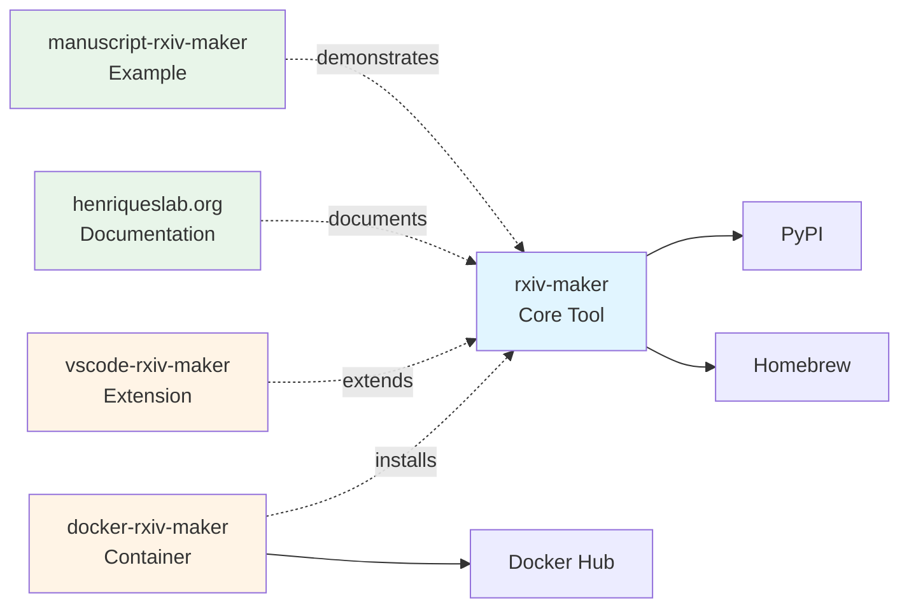

[](https://doi.org/10.48550/arXiv.2508.00836)
[](https://github.com/henriqueslab/rxiv-maker/blob/main/LICENSE)
[](https://github.com/HenriquesLab/rxiv-maker/stargazers)

## 📑 Table of Contents

**Quick Navigation:**
- [Why Rxiv-Maker?](#-why-rxiv-maker) - Benefits for researchers, teams, and publishing
- [Installation](#-installation) - Get started with rxiv-maker
- [Quick Start](#-quick-start) - Create your first manuscript
- [Key Features](#-key-features) - Enhanced markdown, figures, citations, and more
- [Documentation](#-documentation) - User guides and developer resources
- [Essential Commands](#-essential-commands) - Core CLI commands

<details>
<summary><b>🔍 Detailed Topics</b> (click to expand)</summary>

- [Example Manuscript](#-example-manuscript) - See rxiv-maker in action
- [Use Cases](#-use-cases) - Research preprints and workflows
- [Ecosystem & Workflows](#-ecosystem--workflows) - Connected repositories and tools
  - [Core Repositories](#-core-repositories)
  - [Development Tools](#-development-tools)
  - [Deployment Options](#-deployment-options)
  - [Simplified Architecture](#-simplified-architecture)
  - [Repository Cross-Reference](#-repository-cross-reference)
- [Repository Management](#-repository-management) - Multi-manuscript workflows
- [DOCX Export](#-docx-export-for-collaborative-review) - Word format export
- [Community](#-community) - Get help and contribute
- [Contributing](#-contributing) - Join the development
- [Citation](#-citation) - How to cite rxiv-maker
- [License](#-license) - MIT License

</details>

---

# Rxiv-Maker


**Write scientific preprints in Markdown. Generate publication-ready PDFs efficiently.**

Rxiv-Maker converts enhanced Markdown into professional PDFs with automated figure generation, citation management, and LaTeX typesetting. While LaTeX installation is required, users don't need to write LaTeX code directly.

## ✨ Why Rxiv-Maker?

### 🎯 **For Researchers**
- **Write in Markdown**: Focus on content, not formatting
- **Automated Figures**: Python/R scripts become publication figures  
- **Smart Citations**: BibTeX integration with cross-references
- **Instant PDFs**: From Markdown to professional academic PDF

### 🚀 **For Teams**  
- **Git-Friendly**: Version control for manuscripts and figures
- **Reproducible**: All figures generated from code
- **Collaborative**: Standard tools, no vendor lock-in
- **Multi-Platform**: Works everywhere with local installation

### 📈 **For Publishing**
- **arXiv Ready**: Generate submission packages automatically
- **Track Changes**: Visual diff between manuscript versions
- **Quality Assurance**: Built-in validation and error checking

## 🚀 Installation

**⚠️ Choose ONE installation method below** (don't run all of them):

**🍎 macOS (Recommended):**
```bash
# Using Homebrew (macOS package manager - install from https://brew.sh)
brew tap henriqueslab/formulas
brew install rxiv-maker
rxiv check-installation
```

**🐧 Linux / 🪟 Windows WSL (Recommended):**
```bash
# Using pipx (Python package installer - install with: python3 -m pip install --user pipx)
pipx install rxiv-maker
rxiv check-installation
```

**📖 [Full Installation Guide](docs/installation.md)**

<details>
<summary><b>📋 Alternative Installation Methods & Requirements</b></summary>

**🔧 Alternative Methods:**
```bash
# Using pip (Python's standard package installer)
pip install rxiv-maker

# Using uv (modern Python package manager)
uv tool install rxiv-maker

# Verify any installation
rxiv check-installation
```

**📋 First-time Setup Help:**

If you don't have Homebrew (macOS):
```bash
# Install Homebrew first (see https://brew.sh for details)
/bin/bash -c "$(curl -fsSL https://raw.githubusercontent.com/Homebrew/install/HEAD/install.sh)"
```

If you don't have pipx (Linux/Windows):
```bash
# Install pipx first
python3 -m pip install --user pipx
python3 -m pipx ensurepath
```

**📋 Requirements:**
- **LaTeX Distribution**: Required for PDF generation
  - **macOS**: MacTeX (recommended) or BasicTeX
  - **Windows**: MiKTeX or TeX Live
  - **Linux**: TeX Live (install via system package manager)
- **Python 3.11+**: For rxiv-maker CLI and figure generation

**Upgrading:**
```bash
# Automatic upgrade (detects your installation method)
rxiv upgrade

# Or use the same method you used to install:
brew upgrade rxiv-maker              # If you installed with Homebrew
pipx upgrade rxiv-maker              # If you installed with pipx
pip install --upgrade rxiv-maker     # If you installed with pip
uv tool upgrade rxiv-maker           # If you installed with uv
```

</details>

<details>
<summary><b>🐳 Using Docker (No LaTeX Installation Required)</b></summary>

For users who prefer containerized execution without installing LaTeX locally:

**Quick Start:**
```bash
# Interactive terminal with your manuscript
docker run -it --rm -v $(pwd):/workspace henriqueslab/rxiv-maker-base:latest

# Direct PDF generation
docker run --rm -v $(pwd):/workspace henriqueslab/rxiv-maker-base:latest rxiv pdf .
```

**Available Tags:**
- `latest` - Stable PyPI release (recommended for production)
- `dev` - Latest development version from GitHub main
- `weekly` - Weekly builds with security updates
- `v1.x.x` - Specific version pinning for reproducibility

**Pre-installed in Container:**
- rxiv-maker CLI
- Complete TeX Live distribution
- Python 3.11+ with scientific libraries
- R with graphics packages
- All system dependencies

**📦 [docker-rxiv-maker repository](https://github.com/HenriquesLab/docker-rxiv-maker)** - Full documentation and advanced usage

</details>

## 🔥 Quick Start

**Get your first PDF:**

```bash
# Create manuscript
rxiv init my-paper
cd my-paper

# Generate PDF
rxiv pdf
```

**Or explore the complete example manuscript:**

```bash
# Clone the official example with one command
rxiv get-rxiv-preprint
cd manuscript-rxiv-maker/MANUSCRIPT

# Generate PDF
rxiv pdf
```

**🎯 [Getting Started Guide](docs/first-manuscript.md)**

## 🏆 Key Features

- 🎨 **Enhanced Markdown** - Scientific cross-references, auto-numbering, LaTeX math
- 📊 **Automated Figures** - Execute Python/R scripts, Jupyter-like code blocks
- 📚 **Citation Management** - BibTeX, multiple styles, inline DOI resolution
- 🔧 **Developer Experience** - Modern CLI, git-friendly, comprehensive validation

<details>
<summary><b>🔍 See detailed feature descriptions</b></summary>

### 🎨 **Enhanced Markdown**
- Scientific cross-references (`@fig:plot`, `@eq:formula`)
- Auto-numbered figures, tables, and equations
- Mathematical notation with LaTeX math
- Code blocks with syntax highlighting
- Markdown comments (`<!-- note -->`) for TODOs and notes

### 📊 **Automated Figures & Data Analysis**
- Execute Python/R scripts during PDF generation
- **🐍 NEW: Jupyter-like executable Python code blocks**
- Real-time data analysis with `{{py:exec}}` and `{{py:get variable}}`
- Matplotlib, ggplot2, and custom visualizations
- Version-controlled figure code and analysis modules

### 📚 **Citation Management**
- BibTeX integration with `[@citation]` syntax
- Automatic bibliography generation
- **Multiple citation styles**: Choose between numbered `[1, 2]` or author-date `(Smith, 2024)` citations
- **Inline DOI resolution**: Paste DOIs directly in text `10.1038/...` and auto-convert to citations
- CrossRef/DataCite DOI validation and metadata fetching

> 📖 **Learn more**: [Citations Tutorial](https://rxiv-maker.henriqueslab.org/getting-started/citations-tutorial/) | [Complete Guide](https://rxiv-maker.henriqueslab.org/guides/citations-and-references/)

### 🔧 **Developer Experience**
- Modern CLI with rich output and progress bars
- Consistent environments with package management
- Git-friendly workflow with meaningful diffs
- Comprehensive validation and error reporting

</details>

## 🌟 Example Manuscript

> **💡 Get this complete example instantly:**
> ```bash
> rxiv get-rxiv-preprint
> ```
> This clones [manuscript-rxiv-maker](https://github.com/HenriquesLab/manuscript-rxiv-maker) with all features demonstrated.

**Input Markdown:**
```markdown
## Introduction

Recent studies [@smith2023; @jones2024] have shown significant progress.
Figure @fig:results demonstrates our approach.


{#fig:results}

The mathematical model is described by Equation @eq:model:

$$
y = \alpha x + \beta
$$
{#eq:model}
```

**Output:** Professional PDF with numbered figures, automatic citations, cross-references, and LaTeX-quality typesetting.

## 📖 Documentation

### For Users
Visit our **[official documentation website](https://rxiv-maker.henriqueslab.org)** for comprehensive guides:
- **[Installation Guide](https://rxiv-maker.henriqueslab.org/getting-started/installation/)** - Setup for all platforms
- **[First Manuscript Tutorial](https://rxiv-maker.henriqueslab.org/getting-started/first-manuscript/)** - Step-by-step guide
- **[User Guide](https://rxiv-maker.henriqueslab.org/guides/)** - Complete features and workflows
- **[CLI Reference](https://rxiv-maker.henriqueslab.org/api/)** - All commands and options
- **[Troubleshooting](https://rxiv-maker.henriqueslab.org/community/troubleshooting/)** - Solutions to common issues

### For Developers
- **[CONTRIBUTING.md](CONTRIBUTING.md)** - Contribution guidelines
- **[CLAUDE.md](CLAUDE.md)** - AI assistant instructions & testing commands
- **[CI-LOCAL-TESTING.md](CI-LOCAL-TESTING.md)** - Local CI workflow testing
- **[Developer Docs](docs/)** - Technical documentation and API details

## 🎯 Use Cases

### 📄 **Research Preprints**
- arXiv preprints with automated submission packages
- bioRxiv and other preprint servers with professional formatting
- Conference papers with consistent styling

### 📊 **Preprint Features**
- **Reproducible figures** generated from Python/R scripts
- **Live data integration** that updates with analysis changes
- **Professional formatting** optimized for preprint servers

### 🎓 **Preprint Workflows**
- **arXiv submissions** with cross-references and mathematical notation
- **Collaborative preprint writing** with version control
- **Supplementary materials** with automated generation

## 🏃‍♀️ Ecosystem & Workflows

**The rxiv-maker ecosystem consists of interconnected repositories:**

**Core Components:**
- **[rxiv-maker](https://github.com/HenriquesLab/rxiv-maker)** (this repository) - Main Python package and CLI
- **[rxiv-maker.henriqueslab.org](https://rxiv-maker.henriqueslab.org)** - Official documentation website
- **[manuscript-rxiv-maker](https://github.com/HenriquesLab/manuscript-rxiv-maker)** - Example manuscript (arXiv:2508.00836)

**Development & Deployment:**
- **[vscode-rxiv-maker](https://github.com/HenriquesLab/vscode-rxiv-maker)** - VS Code extension
- **[docker-rxiv-maker](https://github.com/HenriquesLab/docker-rxiv-maker)** - Containerized environment

<details>
<summary><b>📦 Detailed Ecosystem Architecture & Integration</b></summary>

### 📦 **Core Repositories**

1. **[rxiv-maker](https://github.com/HenriquesLab/rxiv-maker)** (this repository)
   - Main Python package and CLI tool
   - Core processing engine
   - Development and contribution hub

2. **[rxiv-maker.henriqueslab.org](https://rxiv-maker.henriqueslab.org)** (documentation website)
   - User guides and tutorials
   - API reference and examples
   - Getting started guides

3. **[manuscript-rxiv-maker](https://github.com/HenriquesLab/manuscript-rxiv-maker)**
   - Official example manuscript (published as arXiv:2508.00836)
   - Complete working example with all features
   - Clone with: `rxiv get-rxiv-preprint`

### 🔧 **Development Tools**

- **📝 [VS Code Extension](https://github.com/HenriquesLab/vscode-rxiv-maker)**
  - Syntax highlighting and autocompletion
  - Integrated build commands
  - Real-time validation

- **🐳 [Docker Support](https://github.com/HenriquesLab/docker-rxiv-maker)**
  - Containerized execution environment with pre-installed rxiv-maker
  - Pre-configured LaTeX, Python, R, and all dependencies
  - Perfect for CI/CD and users without local LaTeX installation
  - Separate repository for easier maintenance and faster image updates

### 🚀 **Deployment Options**

- **⚡ Local Installation**: Native system setup (recommended for development)
- **☁️ GitHub Actions**: Automated cloud builds and CI/CD
- **🌐 Google Colab**: Browser-based editing without local installation
- **🐳 Containers**: Docker for reproducible environments

### 📦 **Simplified Architecture**



> **Note**: As of v1.8.4, we've streamlined the ecosystem while maintaining multiple installation options (Homebrew, pip, pipx, uv) with optional Docker support for containerized workflows.
>
> **📋 [Ecosystem Guide](docs/ECOSYSTEM.md)** - Complete architecture and integration patterns
> **📋 [Migration Guide](docs/migration-v1.7.9.md)** - For users upgrading from previous versions

### 🔗 **Repository Cross-Reference**

| Repository | Purpose | Install/Access | Dependencies |
|------------|---------|----------------|--------------|
| **rxiv-maker** (this repo) | Main CLI tool & Python package | `brew install` / `pipx install` | LaTeX |
| **[docker-rxiv-maker](https://github.com/HenriquesLab/docker-rxiv-maker)** | Pre-built container with all deps | `docker pull henriqueslab/rxiv-maker-base` | Docker |
| **[manuscript-rxiv-maker](https://github.com/HenriquesLab/manuscript-rxiv-maker)** | Official example (arXiv:2508.00836) | `rxiv get-rxiv-preprint` | rxiv-maker |
| **[vscode-rxiv-maker](https://github.com/HenriquesLab/vscode-rxiv-maker)** | VS Code extension | VS Code Marketplace | rxiv-maker |
| **[rxiv-maker.henriqueslab.org](https://rxiv-maker.henriqueslab.org)** | Documentation website | Visit website | - |

</details>

## 🚀 Essential Commands

```bash
# Core Commands
rxiv init my-paper         # Create new manuscript
rxiv get-rxiv-preprint     # Clone complete example manuscript
rxiv pdf                   # Generate PDF
rxiv docx                  # Export to DOCX for collaborative review
rxiv validate              # Check manuscript quality
rxiv arxiv                 # Prepare arXiv submission
rxiv track-changes v1 v2   # Visual version comparison

# Repository Management
rxiv create-repo           # Create new manuscript repository (with GitHub integration)
rxiv repos                 # List all manuscript repositories
rxiv repos-search          # Search and clone from GitHub

# Configuration & Maintenance
rxiv config                # Interactive configuration menu
rxiv upgrade               # Upgrade to latest version
rxiv changelog             # View changelog and release notes
rxiv changelog --recent 5  # View last 5 versions
```

### 📂 Repository Management

Manage multiple manuscript repositories with GitHub integration.

**Quick commands**: `rxiv create-repo`, `rxiv repos`, `rxiv repo-init` | **📖 [CLI Reference](docs/cli-reference.md)**

<details>
<summary><b>🗂️ Multi-Manuscript Repository Management with GitHub Integration</b></summary>

```bash
# Initial setup (interactive)
rxiv repo-init

# Or configure manually
rxiv config set-repo-parent-dir ~/manuscripts
rxiv config set-repo-org YourGitHubOrg

# Create new repository (manuscript-{name})
rxiv create-repo my-paper

# List all repositories with git status
rxiv repos

# Search and clone from GitHub
rxiv repos-search my-paper

# Interactive configuration
rxiv config                 # Interactive menu
rxiv config --non-interactive  # Show current settings
```

> **💡 CI/Automation Note:** All interactive commands support non-interactive mode or configuration files for use in CI/CD pipelines and automated workflows. Use `--non-interactive` flag or configure via `~/.rxiv-maker/config` for non-TTY environments.

</details>

### 📄 DOCX Export for Collaborative Review

Share manuscripts with non-LaTeX collaborators in Microsoft Word format.

**Quick command:**
```bash
rxiv pdf --docx              # Build PDF + export to DOCX
rxiv docx                    # Just DOCX export
```

**Features**: Numbered citations, embedded figures, clickable DOI links, supplementary info

<details>
<summary><b>📝 Full DOCX Export Features & Options</b></summary>

Share your manuscript with non-LaTeX collaborators by exporting to Microsoft Word format. The easiest way is to add the `--docx` flag when building your PDF:

```bash
# Build PDF and also export to DOCX
rxiv pdf --docx

# With DOI resolution for missing entries
rxiv pdf --docx --resolve-dois

# Or use the standalone command
rxiv docx                     # Just DOCX (without rebuilding PDF)
rxiv docx --resolve-dois      # With DOI resolution
rxiv docx --no-footnotes      # Without DOI footnotes
```

**Output Location:**
- Automatically saved to `MANUSCRIPT/YEAR__lastname_et_al__rxiv.docx`
- Uses the same naming pattern as the PDF for easy identification
- Saved directly in the manuscript directory

**Features:**
- ✅ **Numbered Citations**: Converts `@cite` to superscript [1], [2], etc.
- ✅ **References Section**: Complete bibliography with clickable DOI links
- ✅ **Embedded Figures**: Automatically converts PDF figures to PNG and embeds them
- ✅ **Figure Captions**: Properly formatted with labels
- ✅ **Formatting Preserved**: Maintains bold, italic, and inline code
- ✅ **Supplementary Info**: Automatically includes 02_SUPPLEMENTARY_INFO.md
- ✅ **Missing DOI Resolution**: Attempts to fetch DOIs from CrossRef/DataCite

**Content Scope:**
- Includes: Main manuscript (01_MAIN.md), supplementary information (02_SUPPLEMENTARY_INFO.md), and figures
- Converts: PDF figures to embedded PNG images (150 DPI, max 6" width)
- Excludes: YAML metadata headers

**[📖 CLI Reference](docs/cli-reference.md)**

</details>

## 🤝 Community

- **💬 [GitHub Discussions](https://github.com/henriqueslab/rxiv-maker/discussions)** - Ask questions, share tips
- **🐛 [Issues](https://github.com/henriqueslab/rxiv-maker/issues)** - Report bugs, request features  
- **📚 [Example Manuscript](https://github.com/HenriquesLab/manuscript-rxiv-maker)** - Clone instantly: `rxiv get-rxiv-preprint`
- **🧪 [Google Colab](https://colab.research.google.com/github/HenriquesLab/rxiv-maker/blob/main/notebooks/rxiv_maker_colab.ipynb)** - Try without installing

## 🏗️ Contributing

We welcome contributions! Whether it's:

- 🐛 Bug reports and fixes
- ✨ New features and improvements  
- 📖 Documentation enhancements
- 🧪 Testing and validation

**Quick contributor setup:**
```bash
git clone https://github.com/henriqueslab/rxiv-maker.git
cd rxiv-maker
pip install -e ".[dev]"
pre-commit install
```

## 📄 Citation

If Rxiv-Maker helps your research, please cite:

```bibtex
@misc{saraiva_2025_rxivmaker,
  title={Rxiv-Maker: an automated template engine for streamlined scientific publications}, 
  author={Bruno M. Saraiva and António D. Brito and Guillaume Jaquemet and Ricardo Henriques},
  year={2025},
  eprint={2508.00836},
  archivePrefix={arXiv},
  url={https://arxiv.org/abs/2508.00836}
}
```

## 📜 License

MIT License - see [LICENSE](LICENSE) for details.

---

<div align="center">

**🔬 From [Jacquemet](https://github.com/guijacquemet) and [Henriques](https://github.com/HenriquesLab) Labs**

*"Because science is hard enough without fighting with LaTeX."*

**[🚀 Start Writing](docs/first-manuscript.md)** | **[📚 User Guide](docs/user_guide.md)** | **[⚙️ CLI Reference](docs/cli-reference.md)**

</div>
