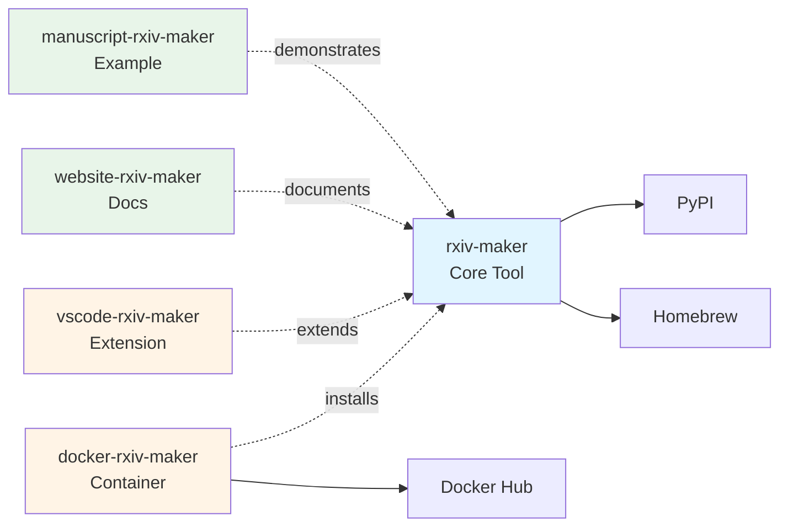

[](https://doi.org/10.48550/arXiv.2508.00836)
[](https://github.com/henriqueslab/rxiv-maker/blob/main/LICENSE)
[](https://github.com/HenriquesLab/rxiv-maker/stargazers)

# Rxiv-Maker


**Write scientific preprints in Markdown. Generate publication-ready PDFs efficiently.**

Rxiv-Maker converts enhanced Markdown into professional PDFs with automated figure generation, citation management, and LaTeX typesetting. While LaTeX installation is required, users don't need to write LaTeX code directly.

## ✨ Why Rxiv-Maker?

### 🎯 **For Researchers**
- **Write in Markdown**: Focus on content, not formatting
- **Automated Figures**: Python/R scripts become publication figures  
- **Smart Citations**: BibTeX integration with cross-references
- **Instant PDFs**: From Markdown to professional academic PDF

### 🚀 **For Teams**  
- **Git-Friendly**: Version control for manuscripts and figures
- **Reproducible**: All figures generated from code
- **Collaborative**: Standard tools, no vendor lock-in
- **Multi-Platform**: Works everywhere with local installation

### 📈 **For Publishing**
- **arXiv Ready**: Generate submission packages automatically
- **Track Changes**: Visual diff between manuscript versions
- **Quality Assurance**: Built-in validation and error checking

## 🚀 Installation

**⚠️ Choose ONE installation method below** (don't run all of them):

**🍎 macOS (Recommended):**
```bash
brew tap henriqueslab/formulas
brew install rxiv-maker
rxiv check-installation
```

**🐧 Linux / 🪟 Windows WSL (Recommended):**
```bash
pipx install rxiv-maker
rxiv check-installation
```

**🔧 Alternative Methods:**
```bash
# Using pip (simpler, but may conflict with system packages)
pip install rxiv-maker

# Using uv (modern, fast package manager)
uv tool install rxiv-maker

# Verify any installation
rxiv check-installation
```

**📋 Requirements:**
- **LaTeX Distribution**: Required for PDF generation
  - **macOS**: MacTeX (recommended) or BasicTeX
  - **Windows**: MiKTeX or TeX Live
  - **Linux**: TeX Live (install via system package manager)
- **Python 3.11+**: For rxiv-maker CLI and figure generation

**Upgrading:**
```bash
# Automatic upgrade (detects your installation method)
rxiv upgrade

# Or use the same method you used to install:
brew upgrade rxiv-maker              # If you installed with Homebrew
pipx upgrade rxiv-maker              # If you installed with pipx
pip install --upgrade rxiv-maker     # If you installed with pip
uv tool upgrade rxiv-maker           # If you installed with uv
```

**Need help?** 📖 **[Installation Guide](docs/installation.md)**

## 🔥 Quick Start

**Get your first PDF quickly:**

```bash
# Create manuscript
rxiv init my-paper
cd my-paper

# Generate PDF
rxiv pdf
```

**Or explore the complete example manuscript:**

```bash
# Clone the official example with one command
rxiv get-rxiv-preprint
cd manuscript-rxiv-maker/MANUSCRIPT

# Generate PDF
rxiv pdf
```

**🎯 [Getting Started Guide](docs/first-manuscript.md)**

## 🏆 Key Features

### 🎨 **Enhanced Markdown**
- Scientific cross-references (`@fig:plot`, `@eq:formula`)
- Auto-numbered figures, tables, and equations
- Mathematical notation with LaTeX math
- Code blocks with syntax highlighting
- Markdown comments (`<!-- note -->`) for TODOs and notes

### 📊 **Automated Figures & Data Analysis**
- Execute Python/R scripts during PDF generation
- **🐍 NEW: Jupyter-like executable Python code blocks**
- Real-time data analysis with `{{py:exec}}` and `{{py:get variable}}`
- Matplotlib, ggplot2, and custom visualizations
- Version-controlled figure code and analysis modules

### 📚 **Citation Management**
- BibTeX integration with `[@citation]` syntax
- Automatic bibliography generation
- **Multiple citation styles**: Choose between numbered `[1, 2]` or author-date `(Smith, 2024)` citations
- **Inline DOI resolution**: Paste DOIs directly in text - automatically converted to proper citations
- CrossRef/DataCite DOI validation and metadata fetching

> 📖 **Learn more**: [10-Minute Tutorial](https://rxiv-maker.henriqueslab.org/getting-started/citations-tutorial/) | [Complete Guide](https://rxiv-maker.henriqueslab.org/guides/citations-and-references/)

### 🔧 **Developer Experience**
- Modern CLI with rich output and progress bars
- Consistent environments with package management
- Git-friendly workflow with meaningful diffs
- Comprehensive validation and error reporting

## 🌟 Example Manuscript

> **💡 Get this complete example instantly:**
> ```bash
> rxiv get-rxiv-preprint
> ```
> This clones [manuscript-rxiv-maker](https://github.com/HenriquesLab/manuscript-rxiv-maker) with all features demonstrated.

**Input Markdown:**
```markdown
# Introduction

{{py:exec
import pandas as pd
import numpy as np

df = pd.read_csv("FIGURES/DATA/experimental_results.csv")

# Calculate correlation between specific columns (safer than iloc)
# Assuming the CSV has columns like 'treatment_effect' and 'baseline_score'
correlation = df['treatment_effect'].corr(df['baseline_score'])
sample_size = len(df)
}}

Our analysis of {{py:get sample_size}} samples in Figure @fig:results shows 
significant improvement over previous methods [@smith2023; @jones2024].


{#fig:results}

The correlation coefficient was r = {{py:get correlation:.2f}} (p < 0.001).

## References
```

**Output:** Professional PDF with numbered figures, live data integration, citations, and LaTeX-quality typesetting.

## 📖 Documentation

### For Users
Visit our **[official documentation website](https://rxiv-maker.henriqueslab.org)** for comprehensive guides:
- **[Installation Guide](https://rxiv-maker.henriqueslab.org/getting-started/installation/)** - Setup for all platforms
- **[First Manuscript Tutorial](https://rxiv-maker.henriqueslab.org/getting-started/first-manuscript/)** - 5-minute walkthrough
- **[User Guide](https://rxiv-maker.henriqueslab.org/guides/)** - Complete features and workflows
- **[CLI Reference](https://rxiv-maker.henriqueslab.org/api/)** - All commands and options
- **[Troubleshooting](https://rxiv-maker.henriqueslab.org/community/troubleshooting/)** - Solutions to common issues

### For Developers
- **[CONTRIBUTING.md](CONTRIBUTING.md)** - Contribution guidelines
- **[CLAUDE.md](CLAUDE.md)** - AI assistant instructions & testing commands
- **[CI-LOCAL-TESTING.md](CI-LOCAL-TESTING.md)** - Local CI workflow testing
- **[Developer Docs](docs/)** - Technical documentation and API details

## 🎯 Use Cases

### 📄 **Research Preprints**
- arXiv preprints with automated submission packages
- bioRxiv and other preprint servers with professional formatting
- Conference papers with consistent styling

### 📊 **Preprint Features**
- **Reproducible figures** generated from Python/R scripts
- **Live data integration** that updates with analysis changes
- **Professional formatting** optimized for preprint servers

### 🎓 **Preprint Workflows**
- **arXiv submissions** with cross-references and mathematical notation
- **Collaborative preprint writing** with version control
- **Supplementary materials** with automated generation

## 🏃‍♀️ Ecosystem & Workflows

**The rxiv-maker ecosystem consists of interconnected repositories:**

### 📦 **Core Repositories**

1. **[rxiv-maker](https://github.com/HenriquesLab/rxiv-maker)** (this repository)
   - Main Python package and CLI tool
   - Core processing engine
   - Development and contribution hub

2. **[website-rxiv-maker](https://github.com/HenriquesLab/website-rxiv-maker)**
   - Official documentation website
   - User guides and tutorials
   - API reference and examples
   - Visit: [rxiv-maker.henriqueslab.org](https://rxiv-maker.henriqueslab.org)

3. **[manuscript-rxiv-maker](https://github.com/HenriquesLab/manuscript-rxiv-maker)**
   - Official example manuscript (published as arXiv:2508.00836)
   - Complete working example with all features
   - Clone with: `rxiv get-rxiv-preprint`

### 🔧 **Development Tools**

- **📝 [VS Code Extension](https://github.com/HenriquesLab/vscode-rxiv-maker)**
  - Syntax highlighting and autocompletion
  - Integrated build commands
  - Real-time validation

- **🐳 [Docker Support](https://github.com/HenriquesLab/docker-rxiv-maker)**
  - Containerized execution environment with pre-installed rxiv-maker
  - Pre-configured LaTeX, Python, R, and all dependencies
  - Perfect for CI/CD and users without local LaTeX installation
  - Separate repository for easier maintenance and faster image updates

### 🚀 **Deployment Options**

- **⚡ Local Installation**: Native system setup (recommended for development)
- **☁️ GitHub Actions**: Automated cloud builds and CI/CD
- **🌐 Google Colab**: Browser-based editing without local installation
- **🐳 Containers**: Docker for reproducible environments

### 📦 **Simplified Architecture**



> **Note**: As of v1.8.4, we've streamlined the ecosystem while maintaining multiple installation options (Homebrew, pip, pipx, uv) with optional Docker support for containerized workflows.
>
> **📋 [Ecosystem Guide](docs/ECOSYSTEM.md)** - Complete architecture and integration patterns
> **📋 [Migration Guide](docs/migration-v1.7.9.md)** - For users upgrading from previous versions

### 🔗 **Repository Cross-Reference**

| Repository | Purpose | Install/Access | Dependencies |
|------------|---------|----------------|--------------|
| **rxiv-maker** (this repo) | Main CLI tool & Python package | `brew install` / `pipx install` | LaTeX |
| **[docker-rxiv-maker](https://github.com/HenriquesLab/docker-rxiv-maker)** | Pre-built container with all deps | `docker pull henriqueslab/rxiv-maker-base` | Docker |
| **[manuscript-rxiv-maker](https://github.com/HenriquesLab/manuscript-rxiv-maker)** | Official example (arXiv:2508.00836) | `rxiv get-rxiv-preprint` | rxiv-maker |
| **[vscode-rxiv-maker](https://github.com/HenriquesLab/vscode-rxiv-maker)** | VS Code extension | VS Code Marketplace | rxiv-maker |
| **[website-rxiv-maker](https://github.com/HenriquesLab/website-rxiv-maker)** | Documentation website | [rxiv-maker.henriqueslab.org](https://rxiv-maker.henriqueslab.org) | - |

## 🚀 Essential Commands

```bash
# Core Commands
rxiv init my-paper          # Create new manuscript
rxiv get-rxiv-preprint     # Clone complete example manuscript
rxiv pdf                    # Generate PDF
rxiv docx                   # Export to DOCX for collaborative review
rxiv validate              # Check manuscript quality
rxiv arxiv                 # Prepare arXiv submission
rxiv track-changes v1 v2   # Visual version comparison

# Repository Management
rxiv create-repo           # Create new manuscript repository (with GitHub integration)
rxiv repos                 # List all manuscript repositories
rxiv repos-search          # Search and clone from GitHub
rxiv config                # Interactive configuration menu

# Maintenance
rxiv upgrade               # Upgrade to latest version
rxiv changelog             # View changelog and release notes
rxiv changelog --recent 5  # View last 5 versions
```

### 📂 Repository Management

Manage multiple manuscript repositories with GitHub integration:

```bash
# Initial setup (interactive)
rxiv repo-init

# Or configure manually
rxiv config set-repo-parent-dir ~/manuscripts
rxiv config set-repo-org YourGitHubOrg

# Create new repository (manuscript-{name})
rxiv create-repo my-paper

# List all repositories with git status
rxiv repos

# Search and clone from GitHub
rxiv repos-search my-paper

# Interactive configuration
rxiv config                 # Interactive menu
rxiv config --non-interactive  # Show current settings
```

> **💡 CI/Automation Note:** All interactive commands support non-interactive mode or configuration files for use in CI/CD pipelines and automated workflows. Use `--non-interactive` flag or configure via `~/.rxiv-maker/config` for non-TTY environments.

### 📄 DOCX Export for Collaborative Review

Share your manuscript with non-LaTeX collaborators by exporting to Microsoft Word format. The easiest way is to add the `--docx` flag when building your PDF:

```bash
# Build PDF and also export to DOCX
rxiv pdf --docx

# With DOI resolution for missing entries
rxiv pdf --docx --resolve-dois

# Or use the standalone command
rxiv docx                     # Just DOCX (without rebuilding PDF)
rxiv docx --resolve-dois      # With DOI resolution
rxiv docx --no-footnotes      # Without DOI footnotes
```

**Output Location:**
- Automatically saved to `MANUSCRIPT/{manuscript_name}.docx`
- Saved directly in the manuscript directory

**Features:**
- ✅ **Numbered Citations**: Converts `@cite` to [1], [2], etc.
- ✅ **DOI Footnotes**: Clickable DOI links for easy reference lookup
- ✅ **Embedded Figures**: Automatically converts PDF figures to PNG and embeds them
- ✅ **Figure Captions**: Properly formatted with labels
- ✅ **Formatting Preserved**: Maintains bold, italic, and inline code
- ✅ **Supplementary Info**: Automatically includes 02_SUPPLEMENTARY_INFO.md
- ✅ **Missing DOI Resolution**: Attempts to fetch DOIs from CrossRef/DataCite

**Content Scope:**
- Includes: Main manuscript (01_MAIN.md), supplementary information (02_SUPPLEMENTARY_INFO.md), and figures
- Converts: PDF figures to embedded PNG images (150 DPI, max 6" width)
- Excludes: YAML metadata headers

**[📖 CLI Reference](docs/cli-reference.md)**

## 🤝 Community

- **💬 [GitHub Discussions](https://github.com/henriqueslab/rxiv-maker/discussions)** - Ask questions, share tips
- **🐛 [Issues](https://github.com/henriqueslab/rxiv-maker/issues)** - Report bugs, request features  
- **📚 [Example Manuscript](https://github.com/HenriquesLab/manuscript-rxiv-maker)** - Clone instantly: `rxiv get-rxiv-preprint`
- **🧪 [Google Colab](https://colab.research.google.com/github/HenriquesLab/rxiv-maker/blob/main/notebooks/rxiv_maker_colab.ipynb)** - Try without installing

## 🏗️ Contributing

We welcome contributions! Whether it's:

- 🐛 Bug reports and fixes
- ✨ New features and improvements  
- 📖 Documentation enhancements
- 🧪 Testing and validation

**Quick contributor setup:**
```bash
git clone https://github.com/henriqueslab/rxiv-maker.git
cd rxiv-maker
pip install -e ".[dev]"
pre-commit install
```

## 📄 Citation

If Rxiv-Maker helps your research, please cite:

```bibtex
@misc{saraiva_2025_rxivmaker,
  title={Rxiv-Maker: an automated template engine for streamlined scientific publications}, 
  author={Bruno M. Saraiva and António D. Brito and Guillaume Jaquemet and Ricardo Henriques},
  year={2025},
  eprint={2508.00836},
  archivePrefix={arXiv},
  url={https://arxiv.org/abs/2508.00836}
}
```

## 📜 License

MIT License - see [LICENSE](LICENSE) for details.

---

<div align="center">

**🔬 From [Jacquemet](https://github.com/guijacquemet) and [Henriques](https://github.com/HenriquesLab) Labs**

*"Because science is hard enough without fighting with LaTeX."*

**[🚀 Start Writing](docs/first-manuscript.md)** | **[📚 User Guide](docs/user_guide.md)** | **[⚙️ CLI Reference](docs/cli-reference.md)**

</div>
