# Rxiv-Maker Ecosystem

Complete guide to the rxiv-maker ecosystem, including repository relationships, workflows, and integration patterns.

## 📋 Table of Contents

- [Overview](#overview)
- [Repository Architecture](#repository-architecture)
- [Installation Decision Tree](#installation-decision-tree)
- [Data Flow](#data-flow)
- [Release Workflow](#release-workflow)
- [Integration Patterns](#integration-patterns)

## 🎯 Overview

The rxiv-maker ecosystem consists of 5 interconnected repositories, each serving a specific purpose in the scientific manuscript authoring workflow.

### Core Philosophy

- **Modularity**: Each repository focuses on a single concern
- **Maintainability**: Separate repos for easier updates and testing
- **Flexibility**: Users choose components that fit their workflow
- **Integration**: Components work seamlessly together

## 🏗️ Repository Architecture

### Repository Details

| Repository | Purpose | Type | Users |
|------------|---------|------|-------|
| **[rxiv-maker](https://github.com/HenriquesLab/rxiv-maker)** | Core tool, CLI, Python package | Python Package | All users |
| **[docker-rxiv-maker](https://github.com/HenriquesLab/docker-rxiv-maker)** | Pre-built Docker images with dependencies | Docker Container | CI/CD, no-LaTeX users |
| **[manuscript-rxiv-maker](https://github.com/HenriquesLab/manuscript-rxiv-maker)** | Official preprint (arXiv:2508.00836) & example | Example Repository | New users, learners |
| **[vscode-rxiv-maker](https://github.com/HenriquesLab/vscode-rxiv-maker)** | VS Code extension for enhanced editing | VS Code Extension | VS Code users |
| **[Documentation Website](https://rxiv-maker.henriqueslab.org)** | Official documentation and user guides | MkDocs Site | All users |

## 🛤️ Installation Decision Tree

```mermaid
flowchart TD
    Start([Which setup method?]) --> Q1{Do you have<br/>LaTeX installed?}

    Q1 -->|No| Q2{Do you want to<br/>install LaTeX?}
    Q1 -->|Yes| Q3{What's your<br/>primary OS?}

    Q2 -->|No| Docker[🐳 Docker Setup<br/>No LaTeX needed]
    Q2 -->|Yes| Q3

    Q3 -->|macOS| Homebrew[🍎 Homebrew<br/>brew install rxiv-maker<br/>Includes LaTeX]
    Q3 -->|Linux/Windows| Q4{Package<br/>manager preference?}

    Q4 -->|pipx| Pipx[📦 pipx<br/>pipx install rxiv-maker<br/>Isolated environment]
    Q4 -->|uv| UV[⚡ uv<br/>uv tool install rxiv-maker<br/>Fast & modern]
    Q4 -->|pip| Pip[🐍 pip<br/>pip install rxiv-maker<br/>Simple but may conflict]

    Q1 -->|Just trying| Colab[☁️ Google Colab<br/>No installation needed]

    Docker --> CheckDocker{Docker<br/>installed?}
    CheckDocker -->|No| InstallDocker[Install Docker Desktop]
    CheckDocker -->|Yes| DockerRun[docker run henriqueslab/rxiv-maker-base]
    InstallDocker --> DockerRun

    Homebrew --> BrewInstall[Run: brew tap henriqueslab/formulas<br/>brew install rxiv-maker]
    Pipx --> PipxInstall[Run: pipx install rxiv-maker]
    UV --> UVInstall[Run: uv tool install rxiv-maker]
    Pip --> PipInstall[Run: pip install rxiv-maker]

    Colab --> ColabOpen[Open Colab notebook]

    BrewInstall --> Verify[✅ rxiv --version]
    PipxInstall --> Verify
    UVInstall --> Verify
    PipInstall --> Verify
    DockerRun --> Verify
    ColabOpen --> Verify

    Verify --> Done([Ready to create manuscripts!])

    style Start fill:#e3f2fd
    style Done fill:#c8e6c9
    style Docker fill:#fff3e0
    style Homebrew fill:#f3e5f5
    style Pipx fill:#e1f5fe
    style UV fill:#e8f5e9
    style Pip fill:#fce4ec
    style Colab fill:#fff9c4
```

### Installation Method Comparison

| Method | Pros | Cons | Best For |
|--------|------|------|----------|
| **Homebrew** | One command, includes LaTeX | macOS only | macOS users (recommended) |
| **pipx** | Isolated, clean | Requires LaTeX separately | Linux users, developers |
| **uv** | Fast, modern | Newer tool, less common | Power users, developers |
| **pip** | Simple, universal | Can conflict with system | Quick tests, containers |
| **Docker** | No LaTeX needed, consistent | Larger download, Docker overhead | CI/CD, no LaTeX install |
| **Colab** | Zero install | Online only, limited | Trying out, quick edits |

## 🔄 Data Flow

### Manuscript to PDF Workflow

```mermaid
flowchart LR
    subgraph "Input Files"
        MD[01_MAIN.md]
        YAML[00_CONFIG.yml]
        BIB[03_REFERENCES.bib]
        FIGS[FIGURES/*.py/*.R/*.mmd]
    end

    subgraph "rxiv-maker Processing"
        direction TB
        V[Validation]
        FG[Figure Generation]
        MD2TEX[Markdown → LaTeX]
        LATEX[LaTeX Compilation]
    end

    subgraph "Output"
        PDF[📄 article.pdf]
        TEX[article.tex]
        LOGS[Build logs]
    end

    MD --> V
    YAML --> V
    BIB --> V
    FIGS --> V

    V --> FG
    FG --> MD2TEX
    YAML --> MD2TEX
    BIB --> MD2TEX
    MD --> MD2TEX

    MD2TEX --> LATEX
    LATEX --> PDF
    LATEX --> TEX
    LATEX --> LOGS

    style V fill:#ffebee
    style FG fill:#e8eaf6
    style MD2TEX fill:#e1f5fe
    style LATEX fill:#f3e5f5
    style PDF fill:#c8e6c9
```

### Component Interactions

## 🚀 Release Workflow

```mermaid
flowchart TB
    Start([New Release Needed]) --> Prep[Prepare Release<br/>- Update CHANGELOG<br/>- Run tests<br/>- Bump version]

    Prep --> GHRelease[Create GitHub Release<br/>Tag: v1.X.Y]

    GHRelease --> PyPI[GitHub Actions<br/>Build & Upload to PyPI]
    PyPI --> PyPIVerify{PyPI<br/>Release Live?}

    PyPIVerify -->|Yes| Homebrew[Update Homebrew Formula<br/>../homebrew-formulas<br/>just release rxiv-maker]
    PyPIVerify -->|No| Wait[Wait 5-10 min]
    Wait --> PyPIVerify

    Homebrew --> BrewTest{Formula<br/>Tests Pass?}
    BrewTest -->|Yes| BrewPush[Push to GitHub]
    BrewTest -->|No| BrewFix[Fix Formula]
    BrewFix --> BrewTest

    GHRelease --> Docker[Docker Auto-Build<br/>Triggered by release tag]
    Docker --> DockerBuild[Build Multi-Platform<br/>AMD64 + ARM64]
    DockerBuild --> DockerPush[Push to Docker Hub<br/>Tags: latest, vX.Y.Z]

    DockerPush --> DockerTest{Docker<br/>Images Work?}
    DockerTest -->|Yes| WebsiteCheck
    DockerTest -->|No| DockerDebug[Debug & Rebuild]
    DockerDebug --> DockerBuild

    BrewPush --> WebsiteCheck{Website<br/>Needs Update?}
    WebsiteCheck -->|Yes| WebUpdate[Update Documentation<br/>Add new features to docs]
    WebsiteCheck -->|No| Announce

    WebUpdate --> WebDeploy[Cloudflare Auto-Deploy]
    WebDeploy --> Announce[📢 Announce Release<br/>- GitHub Discussions<br/>- Social media]

    Announce --> Monitor[Monitor for Issues<br/>24-48 hours]
    Monitor --> Done([Release Complete])

    style Start fill:#e3f2fd
    style Done fill:#c8e6c9
    style PyPI fill:#fff3e0
    style Homebrew fill:#f3e5f5
    style Docker fill:#e1f5fe
    style WebUpdate fill:#fff9c4
    style Announce fill:#f1f8e9
```

### Release Checklist

See [RELEASING.md](../RELEASING.md) for complete details. Quick summary:

1. ✅ Pre-release testing
2. 🏷️ Create GitHub release
3. 📦 Verify PyPI upload
4. 🍺 Update Homebrew formula
5. 🐳 Test Docker images
6. 📚 Update website docs
7. 📢 Announce release

## 🔌 Integration Patterns

### VS Code Extension Integration

The VS Code extension integrates with the CLI tool:

### Docker Integration Pattern

### CI/CD Integration

## 🎯 User Journeys

### New User → First PDF

### Developer → Contributor

## 📊 Ecosystem Statistics

### Repository Sizes (Approximate)

| Repository | Primary Language | Size | Contributors |
|------------|------------------|------|--------------|
| rxiv-maker | Python 95% | ~5MB | 10+ |
| docker-rxiv-maker | Dockerfile | ~2GB (image) | 5+ |
| manuscript-rxiv-maker | Markdown | ~10MB | 5+ |
| vscode-rxiv-maker | TypeScript 90% | ~2MB | 3+ |
| Documentation Website | MkDocs/Markdown | N/A (deployed) | 5+ |

### Distribution Channels

- **PyPI**: Primary Python package distribution
- **Homebrew**: macOS-focused distribution (includes dependencies)
- **Docker Hub**: Container images (~2GB compressed)
- **GitHub Releases**: Source archives and release notes
- **VS Code Marketplace**: Extension distribution

## 🔗 Links

### Primary Resources

- **Main Repository**: https://github.com/HenriquesLab/rxiv-maker
- **Documentation**: https://rxiv-maker.henriqueslab.org
- **Example Manuscript**: https://github.com/HenriquesLab/manuscript-rxiv-maker
- **Docker Images**: https://hub.docker.com/r/henriqueslab/rxiv-maker-base
- **VS Code Extension**: https://marketplace.visualstudio.com/items?itemName=henriqueslab.rxiv-maker

### Related Documentation

- [RELEASING.md](../RELEASING.md) - Complete release process
- [TROUBLESHOOTING_MATRIX.md](TROUBLESHOOTING_MATRIX.md) - Common issues and solutions
- [CONTRIBUTING.md](../CONTRIBUTING.md) - Contribution guidelines
- [CLAUDE.md](../CLAUDE.md) - AI assistant instructions

---

**Last Updated**: November 2025
**Maintainer**: Rxiv-Maker Team
