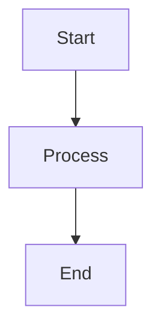

# 📊 Complete Figure Guide for Rxiv-Maker

*Comprehensive guide to figure positioning, formatting, troubleshooting, and best practices*

---

## 🎯 Quick Reference

```markdown
# Standard figure (most common)

{#fig:label tex_position="t" width="0.8\\linewidth"}

# Full-width figure (spans two columns)

{#fig:workflow width="\\textwidth" tex_position="t"}

# Panel reference (no space between number and letter)
As shown in @fig:results A, the data indicates...
```

---

## 📑 Table of Contents

- [Basic Figure Syntax](#basic-figure-syntax)
- [Figure Positioning](#figure-positioning)
- [Width Control](#width-control)
- [Panel References](#panel-references)
- [File Organization](#file-organization)
- [Common Positioning Patterns](#common-positioning-patterns)
- [Troubleshooting](#troubleshooting)
- [Best Practices](#best-practices)

---

## Basic Figure Syntax

All figures in Rxiv-Maker use this basic syntax:

```markdown

{#fig:label tex_position="t" width="0.8\\linewidth"}
```

**Components:**
- `![Caption text]` - Figure caption (supports **bold**, *italic*, and LaTeX math)
- `(FIGURES/Figure__name.ext)` - Path to figure file or generation script
- `{#fig:label}` - Unique identifier for referencing 
- `tex_position="t"` - LaTeX positioning directive
- `width="0.8\\linewidth"` - Figure width specification

---

## Figure Positioning

### `tex_position` Parameter

Controls where LaTeX places your figure:

| Value | Description | Use Case | Result |
|-------|-------------|----------|--------|
| `"t"` | Top of page | **Most common** - places figure at top | Consistent, professional layout |
| `"b"` | Bottom of page | When you want figure at bottom | Good for small figures |
| `"h"` | Here (approximately) | Place figure near the text | Use sparingly - can cause issues |
| `"H"` | Here (exactly) | Force exact placement | Requires `float` package - avoid |
| `"p"` | Dedicated page | For large figures that need their own page | Complex figures, schematics |
| `"ht"` | Top or here | LaTeX chooses best option | Good compromise |
| `"!t"` | Force top | Override LaTeX's spacing rules | When standard "t" fails |

**Recommended Positioning:**
- **Default choice**: `tex_position="t"` - works 95% of the time
- **Large figures**: `tex_position="p"` - gives figures their own page
- **Force placement**: `tex_position="!t"` - when figures appear too late

**Examples:**
```markdown
# Standard positioning (recommended)

{#fig:architecture tex_position="t" width="0.9\\linewidth"}

# Large figure needing dedicated page

{#fig:schematic tex_position="p" width="\\textwidth"}

# Force top placement if figure floats too far

{#fig:results tex_position="!t" width="0.8\\linewidth"}
```

---

## Width Control

### Single Column Figures

```markdown
# Standard width (recommended - leaves margins)
{#fig:example width="0.8\\linewidth"}

# Full column width (fills entire column)
{#fig:example width="\\linewidth"}

# Specific size (use sparingly)
{#fig:example width="10cm"}
{#fig:example width="4in"}

# Percentage of column (alternative to linewidth)
{#fig:example width="0.6\\linewidth"}
```

### Two-Column Spanning Figures

For figures that should span both columns in a two-column layout:

```markdown

{#fig:workflow width="\\textwidth" tex_position="t"}
```

**Important Notes:**
- `width="\\textwidth"` automatically creates a `figure*` environment for two-column spanning
- Always use `tex_position="t"` with spanning figures for best results
- Spanning figures appear at the top of the page where they're referenced

### Width Recommendations

| Figure Type | Recommended Width | Use Case |
|-------------|-------------------|----------|
| Diagrams, plots | `0.8\\linewidth` | Standard figures with comfortable margins |
| Detailed images | `\\linewidth` | When you need maximum detail |
| Small charts | `0.6\\linewidth` | Simple figures that don't need full width |
| Workflows, schematics | `\\textwidth` | Complex figures needing full page width |
| Comparison figures | `\\textwidth` | Side-by-side comparisons |

---

## Panel References

Reference figure panels without unwanted spaces:

```markdown
# Correct - no space between number and letter
As shown in @fig:results A, the data indicates...
Multiple panels: @fig:workflow A-C show the complete process...

# Incorrect - creates unwanted space
As shown in @fig:results (A), the data...  # Renders as "Fig. 1 (A)"
```

**Rendering Examples:**
- `@fig:results` → Fig. 1
- `@fig:results A` → Fig. 1A (no space)
- `@fig:results A-C` → Fig. 1A-C
- `@fig:results A,C` → Fig. 1A,C

---

## File Organization

### Ready Figures (Recommended)

Place completed figures directly in the FIGURES directory:

```
FIGURES/
├── Figure__results.png        # Main figure files
├── Figure__workflow.svg       # Vector graphics for diagrams  
├── Figure__architecture.pdf   # High-quality for print
└── SFigure__appendix.png     # Supplementary figures
```

**Supported Formats:**
- **PNG**: Photos, raster images, screenshots
- **SVG**: Diagrams, charts, illustrations (scalable)  
- **PDF**: Print-quality figures, mixed content
- **JPG**: Photos (use PNG instead when possible)

### Generated Figures

For programmatically generated figures, use generation scripts:

```
FIGURES/
├── Figure__analysis.py          # Python script
├── Figure__analysis/            # Auto-generated directory
│   ├── Figure__analysis.png
│   ├── Figure__analysis.pdf
│   └── Figure__analysis.svg
├── Figure__plots.R              # R script  
├── Figure__plots/
│   └── Figure__plots.png
└── Figure__diagram.mmd          # Mermaid diagram
```

**How Generated Figures Work:**
1. **Script Execution**: `rxiv pdf` automatically runs `.py`, `.R`, and `.mmd` files
2. **Output Detection**: Creates subdirectories for generated files
3. **Format Generation**: Produces PNG, PDF, and SVG versions when possible
4. **Caching**: Only regenerates when script changes

---

## Common Positioning Patterns

### 1. Standard Figure (Most Common)
```markdown

{#fig:results tex_position="t" width="0.8\\linewidth"}
```

**When to use:** 95% of figures - charts, plots, diagrams, images

### 2. Full-Width Figure (Two-Column Documents)
```markdown
  
{#fig:workflow width="\\textwidth" tex_position="t"}
```

**When to use:** Complex workflows, large diagrams, comparison figures

### 3. Small Inline Figure
```markdown

{#fig:diagram tex_position="h" width="0.5\\linewidth"}
```

**When to use:** Simple illustrations, icons, small charts (use sparingly)

### 4. Large Figure (Dedicated Page)
```markdown

{#fig:schematic tex_position="p" width="\\textwidth"}
```

**When to use:** Highly detailed figures, technical schematics, complex layouts

### 5. Generated Figure (Python/R)
```markdown

{#fig:analysis tex_position="t" width="0.9\\linewidth"}
```

**When to use:** Data visualizations, statistical plots, dynamic content

---

## Troubleshooting

### Issue: Figure Appears on Wrong Page

**Symptoms:** Figure appears several pages after its reference

**Solutions:**
```markdown
# Try forcing top placement
{#fig:example tex_position="!t" width="0.8\\linewidth"}

# For large figures, use dedicated page
{#fig:example tex_position="p" width="\\textwidth"}

# Reduce figure size to help placement
{#fig:example tex_position="t" width="0.7\\linewidth"}
```

### Issue: Figure Too Large or Small

**Solutions:**
```markdown
# Reduce width for oversized figures
{#fig:example width="0.6\\linewidth"}  # Instead of 0.8

# For detailed figures needing more space
{#fig:example width="\\linewidth"}     # Full column width

# For two-column spanning
{#fig:example width="\\textwidth"}     # Full page width
```

### Issue: Spacing Issues with Panel References

**Problem:** Unwanted spaces in references like "Fig. 1 A" instead of "Fig. 1A"

**Solution:**
```markdown
# Correct format (no parentheses)
@fig:example A shows the primary result...

# Incorrect formats to avoid  
@fig:example (A) shows...     # Creates unwanted space
@fig:example, panel A shows... # Verbose and inconsistent
```

### Issue: Missing Figure Files

**Symptoms:**
- `rxiv pdf` fails with validation errors
- Error messages like: "Figure file not found: FIGURES/Figure__analysis/Figure__analysis.png"
- LaTeX compilation fails due to missing figure files

**✅ Automatic Solution (Recommended):**

Simply run:
```bash
rxiv pdf
```

**The build system automatically:**
1. **Auto-detects missing figures** - Checks if output files exist for each generation script
2. **Executes figure generation scripts** - Runs `.py`, `.R`, `.mmd` files
3. **Generates missing files** - Creates PNG, PDF, and SVG versions  
4. **Continues with PDF build** - Proceeds with LaTeX compilation

**Manual Solutions:**
```bash
# Navigate to FIGURES directory
cd MANUSCRIPT/FIGURES

# Run specific generation scripts
python SFigure__analysis.py
Rscript Figure__plots.R

# Force regenerate ALL figures
rxiv pdf --force-figures

# Generate figures only (no PDF)
rxiv figures --figures-dir MANUSCRIPT/FIGURES --verbose
```

### Issue: Figure Not Found or Wrong Path

**Solutions:**
```markdown
# Check correct path format
         # Correct
          # Wrong - case sensitive  
          # Wrong - file doesn't exist

# Verify file exists
ls -la FIGURES/Figure__name.*

# For generated figures, ensure script exists
ls -la FIGURES/Figure__name.py              # Python script
ls -la FIGURES/Figure__name.R               # R script
ls -la FIGURES/Figure__name.mmd             # Mermaid diagram
```

### Issue: Poor Figure Quality in PDF

**Solutions:**
```bash
# Use vector formats when possible
FIGURES/Figure__diagram.svg    # Best for diagrams
FIGURES/Figure__chart.pdf      # Good for complex figures

# For raster images, use high DPI
# In Python matplotlib:
plt.savefig('output.png', dpi=300, bbox_inches='tight')

# In R:
ggsave("output.png", dpi=300, width=8, height=6)
```

### Issue: Mermaid Diagrams Not Rendering

**Solutions:**
```bash
# Check .mmd file syntax
cat FIGURES/Figure__diagram.mmd

# Test Mermaid syntax online at https://mermaid.live/
# Ensure proper Mermaid format:


# Regenerate with verbose output
rxiv pdf --verbose --force-figures
```

### Issue: R/Python Script Failures

**Symptoms:** Generated figures fail to create

**Solutions:**
```bash
# Test scripts individually
cd FIGURES/
python Figure__analysis.py        # Check for Python errors
Rscript Figure__plots.R           # Check for R errors

# Check Python environment
python --version                  # Need Python 3.7+
pip list | grep matplotlib        # Check required packages

# Check R installation
R --version                       # Check R availability
R -e "library(ggplot2)"          # Check required packages

# Install missing dependencies
pip install matplotlib numpy pandas seaborn
# Or in R:
install.packages(c("ggplot2", "dplyr", "readr"))
```

### Issue: Memory Issues with Large Figures

**Solutions:**
```python
# In Python scripts - optimize for memory
import matplotlib.pyplot as plt
plt.ioff()  # Turn off interactive mode

# Close figures after saving
plt.savefig('output.png', dpi=150)  # Lower DPI for large figures
plt.close('all')  # Free memory
```

```r
# In R scripts - manage memory
# Use reasonable figure sizes
png("output.png", width=1200, height=800, res=150)  # Not too high resolution
# ... plotting code ...
dev.off()
```

---

## Best Practices

### 1. Figure Naming Conventions
```
# Main figures
Figure__workflow.svg          # Descriptive names, not numbers
Figure__results_comparison.png   # Use underscores for spaces
Figure__system_architecture.pdf  # Clear, specific descriptions

# Supplementary figures  
SFigure__detailed_analysis.py    # Prefix with "SFigure__"
SFigure__raw_data_plots.R       # Generated supplementary content
```

### 2. Consistent Positioning Strategy
```markdown
# Standard approach for most figures
{#fig:name tex_position="t" width="0.8\\linewidth"}

# Large/complex figures
{#fig:name tex_position="p" width="\\textwidth"}

# Multi-column spanning  
{#fig:name tex_position="t" width="\\textwidth"}
```

### 3. Caption Quality
```markdown
# Excellent caption example

{#fig:architecture tex_position="t" width="\\textwidth"}
```

**Caption Best Practices:**
- **Bold the title** for emphasis
- Include sufficient detail for standalone understanding
- Explain abbreviations and symbols
- Describe key findings or takeaways
- Use panel labels (A), (B), (C) when applicable

### 4. File Format Selection

| Content Type | Recommended Format | Why |
|-------------|-------------------|-----|
| **Diagrams, flowcharts** | SVG | Scalable, crisp at any size |
| **Data plots, charts** | SVG or PDF | Vector graphics maintain quality |
| **Screenshots** | PNG | Lossless compression for UI elements |
| **Photographs** | PNG or JPG | Appropriate for raster content |
| **Mixed content** | PDF | Handles both vector and raster |
| **Print publications** | PDF | Highest quality for journals |

### 5. Generation Scripts Best Practices

```python
# Python figure generation template
import matplotlib.pyplot as plt
import numpy as np

# Configure for publication quality
plt.style.use('seaborn-v0_8-whitegrid')  # Clean style
plt.rcParams['font.size'] = 12          # Readable font size
plt.rcParams['figure.dpi'] = 150        # Good resolution

def main():
    # Create figure
    fig, ax = plt.subplots(figsize=(8, 6))
    
    # Your plotting code here
    x = np.linspace(0, 10, 100)
    y = np.sin(x)
    ax.plot(x, y, linewidth=2, label='sin(x)')
    
    # Professional formatting
    ax.set_xlabel('X-axis Label')
    ax.set_ylabel('Y-axis Label') 
    ax.legend()
    ax.grid(True, alpha=0.3)
    
    # Save with tight layout
    plt.tight_layout()
    plt.show()  # Rxiv-Maker captures this
    
if __name__ == "__main__":
    main()
```

```r
# R figure generation template
library(ggplot2)
library(dplyr)

# Create publication-quality plot
create_plot <- function() {
    # Sample data
    data <- data.frame(
        x = 1:10,
        y = rnorm(10)
    )
    
    # Create plot with professional theme
    p <- ggplot(data, aes(x = x, y = y)) +
        geom_line(size = 1.2, color = "blue") +
        geom_point(size = 3, color = "darkblue") +
        theme_minimal() +
        theme(
            text = element_text(size = 12),
            plot.title = element_text(size = 14, face = "bold")
        ) +
        labs(
            title = "Sample Analysis Results",
            x = "Time Point",
            y = "Measured Value"
        )
    
    print(p)  # Rxiv-Maker captures this
}

# Execute
create_plot()
```

### 6. Validation and Testing
```bash
# Always validate before final build
rxiv validate

# Test figure generation specifically
rxiv pdf --force-figures --verbose

# Check figure quality in output
ls -la output/Figures/*/
```

### 7. Version Control Considerations
```bash
# Include generated figures in git for reproducibility
git add FIGURES/Figure__*/  # Generated figure files
git add FIGURES/*.py        # Generation scripts
git add FIGURES/*.R         # R scripts
git add FIGURES/*.mmd       # Mermaid diagrams

# Clean generated files for testing
rxiv clean --figures-only
rxiv pdf  # Should regenerate automatically
```

---

## Example: Complete Professional Figure

```markdown
![**Manuscript Processing Workflow in Rxiv-Maker.** The system implements 
a three-stage pipeline: (A) **Input Processing** where Markdown content and 
figure generation scripts are parsed and validated, (B) **Content Conversion** 
where text is converted to LaTeX while figures are generated from Python/R 
scripts or Mermaid diagrams, and (C) **Output Generation** where the complete 
LaTeX document is compiled to PDF with proper figure positioning and referencing. 
The automated approach ensures reproducible, high-quality manuscript generation 
while allowing authors to focus on content creation rather than technical 
formatting details.](FIGURES/Figure__workflow.mmd)
{#fig:workflow width="\\textwidth" tex_position="t"}

The workflow in @fig:workflow A shows how user content is processed, while 
@fig:workflow B demonstrates the automated conversion pipeline that handles 
technical manuscript preparation without user intervention.
```

This creates a professional, well-positioned figure with:
- **Comprehensive caption** explaining the figure content
- **Proper width** (`\\textwidth`) for complex workflow diagram  
- **Optimal positioning** (`tex_position="t"`) for consistent placement
- **Panel references** (@fig:workflow A) with proper formatting
- **Generated content** (`.mmd` file) that's automatically processed

**🎯 Remember**: Great figures combine clear visual design with professional positioning and comprehensive captions!

---

**📚 [User Guide](user_guide.md) | ⚙️ [CLI Reference](../reference/cli-reference.md) | 🔧 [Troubleshooting](../troubleshooting/troubleshooting.md)**