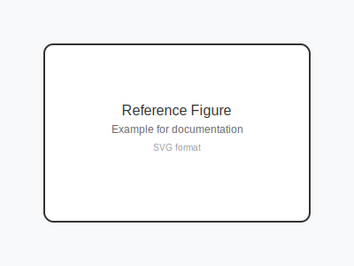

# Rxiv-Markdown Syntax Reference

Rxiv-Markdown is an enhanced version of standard Markdown designed specifically for scientific writing. It includes 20+ advanced features for academic publishing, including scientific cross-references, citations, mathematical expressions, and precise figure positioning.

## Table of Contents
- [Basic Markdown](#basic-markdown)
- [Scientific Cross-References](#scientific-cross-references)
- [Citations](#citations)
- [Figures](#figures)
- [Tables](#tables)
- [Mathematical Expressions](#mathematical-expressions)
- [Text Formatting](#text-formatting)
- [Document Control](#document-control)
- [Advanced Features](#advanced-features)

---

## Basic Markdown

Rxiv-Markdown supports all standard Markdown syntax:

```markdown
# Heading 1
## Heading 2
### Heading 3

**Bold text**
*Italic text*
`inline code`

- Unordered list
- Another item

1. Ordered list
2. Another item

[Link text](https://example.com)
```

---

## Scientific Cross-References

### Figure References
```markdown
@fig:label          # References a figure: "Fig. 1"
@fig:label A        # Panel reference: "Fig. 1A" (no space)
@sfig:label         # Supplementary figure: "Fig. S1"
@sfig:label B       # Supplementary panel: "Fig. S1B"
```

### Table References
```markdown
@tbl:label          # References a table: "Table 1"
@stable:label       # Supplementary table: "Table S1"
```

### Equation References
```markdown
@eq:label           # References an equation: "Eq. (1)"
```

### Section References
```markdown
@sec:label          # References a section: "Section 1"
```

**Example Usage:**
```markdown
As shown in @fig:workflow A, the system processes input data. 
The results are summarized in @tbl:results, and the mathematical 
relationship is described by @eq:correlation.
```

---

## Citations

### Basic Citations
```markdown
@author2023                    # Single citation: "(Author, 2023)"
[@author2023]                  # Parenthetical: "(Author, 2023)"
[@author2023; @smith2024]      # Multiple: "(Author, 2023; Smith, 2024)"
```

### Advanced Citations
```markdown
[@author2023, p. 42]           # With page number
[@author2023, see also @smith2024]  # With additional text
See @author2023 for details.  # In-text citation
```

---

## Figures

Figures are a core component of scientific manuscripts. Rxiv-Markdown provides extensive control over figure positioning, sizing, and layout.

### Basic Figure Syntax
```markdown

{#fig:label tex_position="t" width="0.8\linewidth"}
```

### Figure Positioning Options

#### Position Control (`tex_position`)
| Value | Description | Use Case |
|-------|-------------|----------|
| `"t"` | Top of page | Most common, places figure at top |
| `"b"` | Bottom of page | When you want figure at bottom |
| `"h"` | Here (approximately) | Place figure near the text |
| `"H"` | Here (exactly) | Force exact placement |
| `"p"` | Dedicated page | For large figures |
| `"!t"` | Force top | Override LaTeX's spacing rules |

#### Width Control
```markdown
# Standard widths
{width="0.8\linewidth"}        # 80% of column width (recommended)
{width="\linewidth"}           # Full column width
{width="\textwidth"}           # Full page width (spans both columns)

# Specific measurements
{width="10cm"}                 # Fixed width in centimeters
{width="4in"}                  # Fixed width in inches

# Percentage (converted to linewidth)
{width="75%"}                  # Converted to 0.75\linewidth
```

### Figure Examples

#### Standard Single-Column Figure
```markdown

{#fig:architecture tex_position="t" width="0.8\linewidth"}
```

#### Full-Width Two-Column Spanning Figure
```markdown

{#fig:workflow width="\textwidth" tex_position="t"}
```

#### Small Inline Figure
```markdown

{#fig:icon tex_position="h" width="0.4\linewidth"}
```

#### Large Figure on Dedicated Page
```markdown

{#fig:detailed tex_position="p" width="\textwidth"}
```

### Panel References
Reference specific panels within figures without unwanted spaces:

```markdown
As shown in @fig:results A, the first condition shows...
The second condition (@fig:results B) demonstrates...
Both panels (@fig:results A and @fig:results B) indicate...
```

**Renders as:** "Fig. 1A", "Fig. 1B" (no space between number and letter)

### Figure File Organization

#### Ready Figures (Recommended)
Place figures directly in the FIGURES directory:
```
FIGURES/
├── Figure__results.png
├── Figure__workflow.svg
└── Figure__architecture.pdf
```

#### Generated Figures
For programmatically generated figures:
```
FIGURES/
├── Figure__analysis.py          # Python script
├── Figure__analysis/            # Auto-generated directory
│   ├── Figure__analysis.png
│   └── Figure__analysis.pdf
└── Figure__plots.R              # R script
```

### Figure Troubleshooting
For comprehensive troubleshooting of figure positioning, layout issues, and advanced positioning techniques, see the **[Figure Positioning Guide](../tutorials/figure-positioning.md)**.

---

## Tables

### Basic Table Syntax
```markdown
| Column 1 | Column 2 | Column 3 |
|----------|----------|----------|
| Data 1   | Data 2   | Data 3   |
| Data 4   | Data 5   | Data 6   |
{#tbl:example}
```

### Table with Caption
```markdown
| Parameter | Value | Unit |
|-----------|-------|------|
| Temperature | 25 | °C |
| Pressure | 1013 | hPa |
{#tbl:conditions}

Table: Experimental conditions used in the study.
```

### Supplementary Tables
```markdown
| Gene | Expression | p-value |
|------|------------|---------|
| GAPDH | 1.0 | < 0.001 |
| ACTB | 0.95 | < 0.001 |
{#stable:genes}
```

---

## Mathematical Expressions

### Inline Mathematics
```markdown
The relationship between energy and mass is $E = mc^2$.
Chemical formulas like $\text{H}_2\text{O}$ and $\text{CO}_2$ are supported.
```

### Display Mathematics
```markdown
$$\sigma = \sqrt{\frac{1}{N-1} \sum_{i=1}^{N} (x_i - \bar{x})^2}$${#eq:std_dev}
```

### Chemical Equations
```markdown
$$\text{CaCO}_3 + 2\text{HCl} \rightarrow \text{CaCl}_2 + \text{H}_2\text{O} + \text{CO}_2$${#eq:reaction}
```

---

## Text Formatting

### Scientific Notation
```markdown
~subscript~         # Renders as subscript
^superscript^       # Renders as superscript

H~2~O               # Water molecule
E = mc^2^           # Einstein's equation
25°C                # Temperature notation
```

### Emphasis and Styling
```markdown
**Bold text**
*Italic text*
***Bold and italic***
`inline code`
~~Strikethrough~~
```

### Special Characters
```markdown
°   # Degree symbol (Alt+0176 on Windows, Option+Shift+8 on Mac)
±   # Plus-minus symbol
×   # Multiplication symbol
÷   # Division symbol
```

---

## Document Control

### Page Breaks
```markdown
<newpage>           # Insert page break
```

### Line Breaks
```markdown
<br>                # Line break
```

### Comments (Not Rendered)
```markdown
<!-- This is a comment and won't appear in the PDF -->
```

---

## Advanced Features

### Code Blocks with Syntax Highlighting
```python
# Python code example
import matplotlib.pyplot as plt
import numpy as np

x = np.linspace(0, 10, 100)
y = np.sin(x)
plt.plot(x, y)
plt.savefig('sine_wave.png')
```

### Blockquotes
```markdown
> This is a blockquote.
> It can span multiple lines.
```

### Definition Lists
```markdown
Term 1
:   Definition of term 1

Term 2
:   Definition of term 2
```

### Footnotes
```markdown
This text has a footnote[^1].

[^1]: This is the footnote content.
```

---

## Best Practices

### Figure Management
1. **Use descriptive names**: `Figure__workflow` not `Figure1`
2. **Consistent positioning**: Use `tex_position="t"` for most figures
3. **Appropriate widths**: `0.8\linewidth` for single-column, `\textwidth` for spanning
4. **Panel references**: Always use `@fig:name A` format

### Citation Management
1. **Consistent keys**: Use author-year format (`smith2023`)
2. **Proper syntax**: Use `[@citation]` for parenthetical citations
3. **Multiple citations**: Separate with semicolons `[@cite1; @cite2]`

### Mathematical Expressions
1. **Inline vs display**: Use `$...$` for inline, `$$...$$` for display
2. **Equation labels**: Always label important equations `{#eq:label}`
3. **Chemical formulas**: Use `\text{}` for chemical elements

### Cross-References
1. **Descriptive labels**: Use clear, descriptive labels (`fig:workflow` not `fig:1`)
2. **Consistent naming**: Follow a consistent labeling scheme
3. **Panel references**: Use space between figure reference and panel letter

---

## Related Documentation

- **[Figure Positioning Guide](../tutorials/figure-positioning.md)** - Complete guide to figure placement and layout
- **[User Guide](../getting-started/user_guide.md)** - Complete usage instructions
- **[Troubleshooting Guide](../troubleshooting/common-issues.md)** - Common issues and solutions
- **[CLI Reference](../CLI_REFERENCE.md)** - Command-line interface documentation

---

## Quick Reference

### Most Common Patterns
```markdown
# Figure with positioning
{#fig:label tex_position="t" width="0.8\linewidth"}

# Figure reference
See @fig:label for details.

# Panel reference  
As shown in @fig:label A, the results indicate...

# Citation
Recent studies [@author2023; @smith2024] have shown...

# Equation
$$E = mc^2$${#eq:einstein}

# Equation reference
According to @eq:einstein, energy and mass are related.
```

This comprehensive syntax reference covers all aspects of Rxiv-Markdown. For specific issues or advanced use cases, refer to the linked documentation guides above.