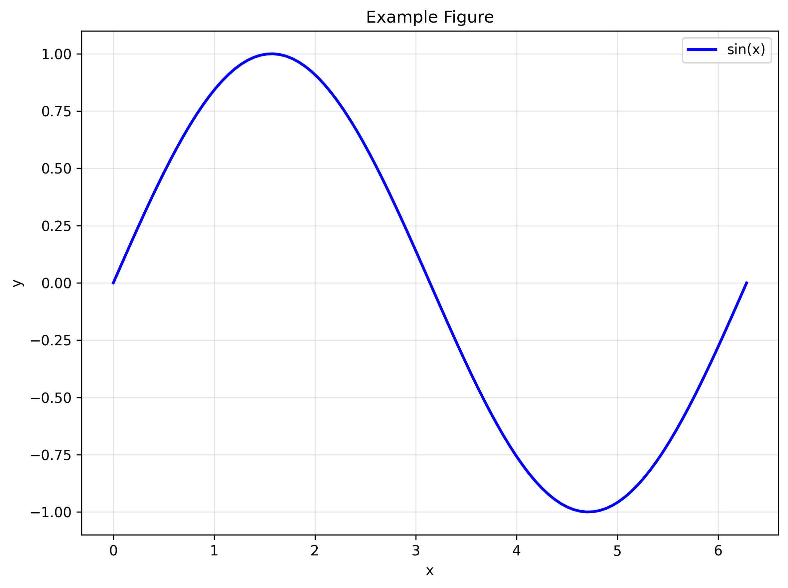

# My Research Paper

## Introduction

Your introduction goes here. You can use all the features of **rxiv-markdown**:

- Citations: @your_reference_2024
- Figure references: @fig:example

## Methods

Describe your methods here.

### Subsection

You can use subsections to organize your content.

## Results

Present your results here. For example, see @fig:example for an example visualization.

{#fig:example} **Example Figure.** This is an example figure showing a sine wave generated by the Python script in FIGURES/Figure__example.py. This demonstrates the basic workflow of rxiv-maker figure generation.

## Discussion

Discuss your findings here.

## Conclusion

Conclude your manuscript here.

## Acknowledgements

Acknowledge contributions here.
